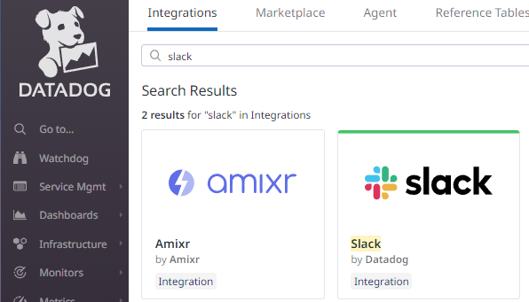
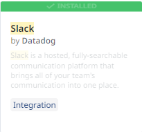
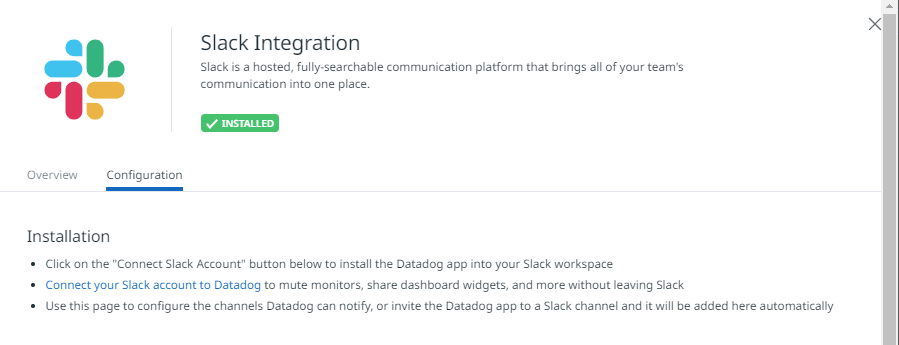
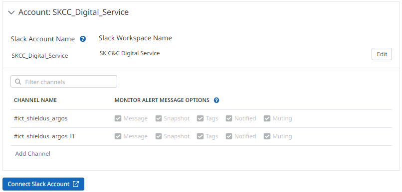
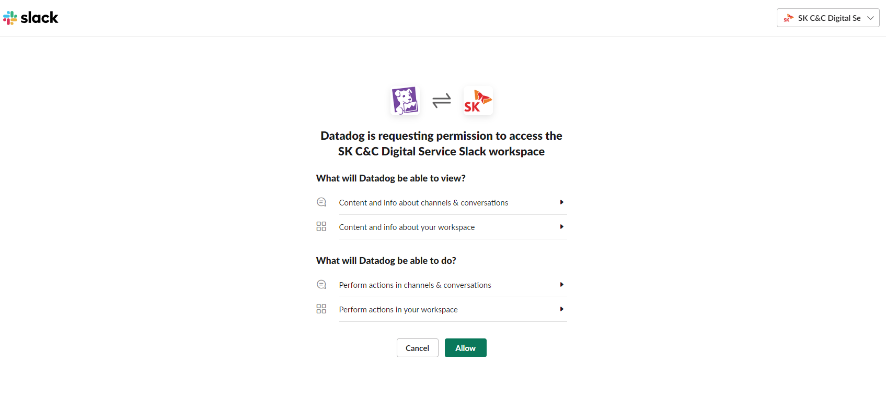
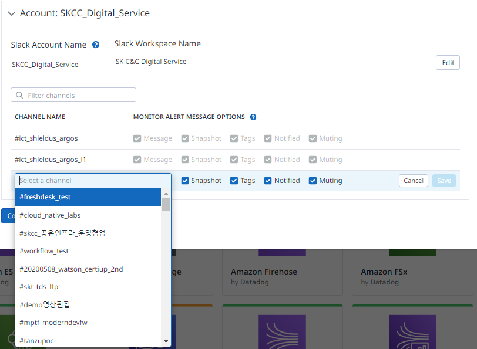
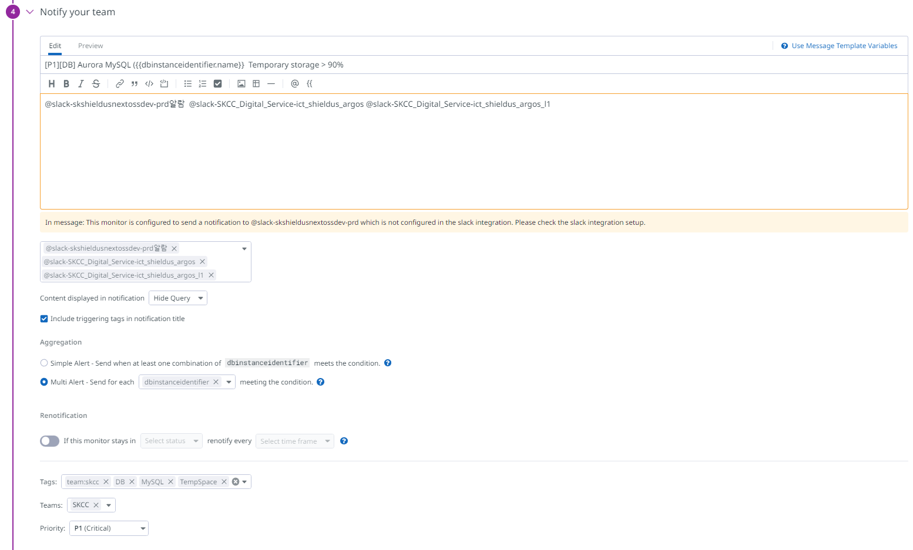
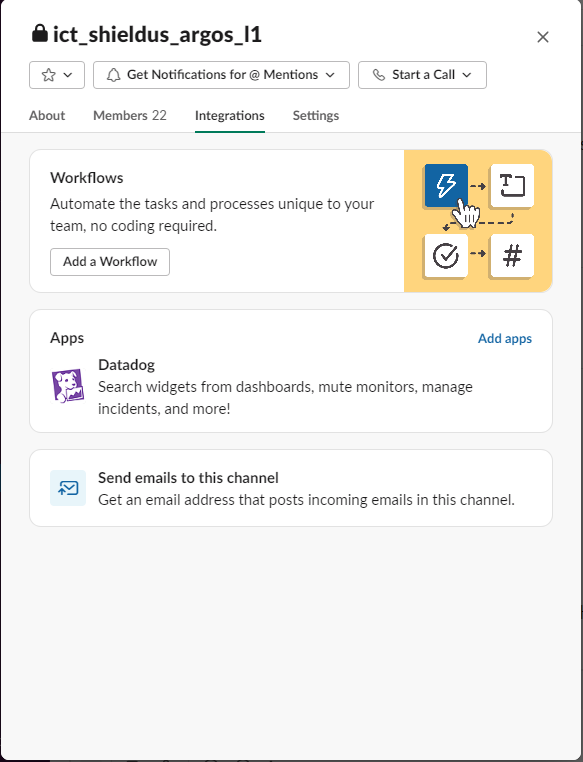

# Datadog

> [Notifications](https://docs.datadoghq.com/monitors/notify/)  
> [[ Datadog ] Monitor 설정시 조건에 따라 서로 다른 채널로 알람을 발생 시키고 싶습니다.](https://support.skdt.co.kr/ko/support/solutions/articles/42000098992--datadog-monitor-%EC%84%A4%EC%A0%95%EC%8B%9C-%EC%A1%B0%EA%B1%B4%EC%97%90-%EB%94%B0%EB%9D%BC-%EC%84%9C%EB%A1%9C-%EB%8B%A4%EB%A5%B8-%EC%B1%84%EB%84%90%EB%A1%9C-%EC%95%8C%EB%9E%8C%EC%9D%84-%EB%B0%9C%EC%83%9D-%EC%8B%9C%ED%82%A4%EA%B3%A0-%EC%8B%B6%EC%8A%B5%EB%8B%88%EB%8B%A4-)  


## Datadog 에서 심각도에 따라 제목에 달리 표현하는 방법
### 제목 변경
```
{{#is_alert}}
  <ALERT_MESSAGE_TEXT> <@-NOTIFICATION>
{{/is_alert}}
```

### Priority 변경
```
{{#is_alert}}
{{override_priority 'P1'}}
 ...
{{/is_alert}}

{{#is_warning}}
{{override_priority 'P4'}}
...
{{/is_warning}}
```

#### 각 전파 채널별로 Monitor를 새로 만들거나 clone하여 System별로 각각 Monitor를 생성하는 것을 권장


Datadog에서는 모니터의 알림 제목을 변경할 수 있습니다. 모니터를 생성하면 “Say what’s happening” 섹션에서 알림 제목을 추가할 수 있습니다1. 이 섹션에서는 팀에게 보내는 알림을 설정할 수 있습니다1. 또한, Datadog의 새로운 Tiered Alerts 기능을 사용하면 알림의 심각도에 따라 다른 사람이나 채널로 전송할 수 있습니다2.

받은 메시지. Datadog에서는 모니터의 알림 제목을 변경할 수 있습니다. 모니터를 생성하면 "Say what’s happening" 섹션에서 알림 제목을 추가할 수 있습니다. 이 섹션에서는 팀에게 보내는 알림을 설정할 수 있습니다. 또한, Datadog의 새로운 Tiered Alerts 기능을 사용하면 알림의 심각도에 따라 다른 사람이나 채널로 전송할 수 있습니다.
자세한 정보:
1. docs.datadoghq.com
2. datadoghq.com
3. docs.datadoghq.com
4. docs.datadoghq.com


## 실적용 예
### Source
```
(avg:aws.rds.free_storage_space{dbinstanceidentifier:sksh-argos-p-rds-mariadb-*} by {dbinstanceidentifier} / avg:aws.rds.total_storage_space{dbinstanceidentifier:sksh-argos-p-rds-mariadb-*} by {dbinstanceidentifier}) * 100
```

### Notify your team
```
[P3][DB] MariaDB ({{dbinstanceidentifier.name}})  Storage Usage > 90%
```

```
{{#is_alert}}
{{override_priority 'P2'}}
[P2][DB] MariaDB ({{dbinstanceidentifier.name}})  Storage Usage > 90%
{{/is_alert}}

{{#is_warning}}
[P3][DB] MariaDB ({{dbinstanceidentifier.name}})  Storage Usage > 80%
{{/is_warning}}
@slack-SKCC_Digital_Service-ict_shieldus_argos @slack-skshieldusnextossdev-prd알람
```

## Integration
### Webhook 
#### Name
```
sendSKCCTeams
```

#### URL
```
https://skcccorp.webhook.office.com/webhookb2/**********
```

#### Payload
```
{
    "@context": "https://schema.org/extensions",
    "@type": "MessageCard",
    "themeColor": "64a837",
    "title": "$EVENT_TITLE",
    "text": "$EVENT_MSG"
}
```

### Slack
- Slack
    
    

- Connect Slack Account
    
    
    

- Add Channel
  

#### Account
```
SKCC_Digital_Service
```

#### CHANNEL NAME
```
#ict_shieldus_argos
#ict_shieldus_argos_l1
```

#### MONITOR ALERT MESSAGE OPTIONS
- Message
- Snapshot
- Tags
- Notified
- Muting

#### Datadog Alert 에서 사용예
```
[P1][Network] DX Connection Down ({{connectionid.name}})
```
```
[참고 - 연결 정보]
# Data망
- dxcon-fh5l0k7k : 1st VIF (KINX)
- dxcon-fg6pdahf : 2nd VIF (LG U+)
# 신호수신망
- dxcon-fh891mus : 1st VIF (KINX)
- dxcon-fg44j36q : 2nd VIF (KINX)
- dxcon-fg6a3n0g : 3rd VIF (LG U+)
# 고객센터망
- dxcon-fgqxwnve : 1st VIF (SKCC / KINX)
- dxcon-fh2s52kw : 2nd VIF (SKCC / KINX) 

@slack-skshieldusnextossdev-prd알람 
@slack-SKCC_Digital_Service-ict_shieldus_argos
@slack-SKCC_Digital_Service-ict_shieldus_argos_l1 
```
  

## Slack 채널에서 Datadog App 추가
  
