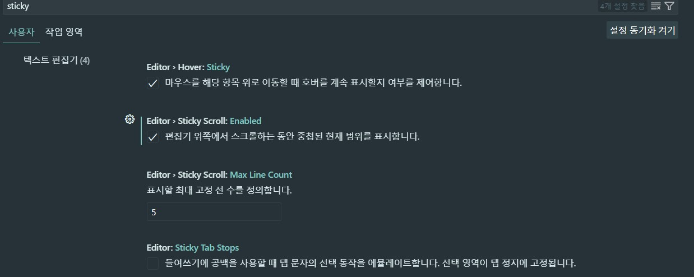

# [Visual Studio Code](https://code.visualstudio.com/download)  

- IntelliSense, Debugging, Built-in Git, Extensions 등 다양한 기능들을 제공

[LINK]
[VS Code Tips and Tricks](https://github.com/Microsoft/vscode-tips-and-tricks?wt.mc_id=DX_881390#extension-recommendations)

## 확장팩  
[Extensions for Visual Studio Code](https://marketplace.visualstudio.com/)  
[Extensions for the Visual Studio family of products](https://marketplace.visualstudio.com/vscode)  
[Extensions for Azure DevOps](https://marketplace.visualstudio.com/azuredevops)  

### 기본 확장팩 추천  

> [Korean Language Pack for Visual Studio Code](https://marketplace.visualstudio.com/items?itemName=MS-CEINTL.vscode-language-pack-ko)  
> [Material Theme](https://marketplace.visualstudio.com/items?itemName=Equinusocio.vsc-material-theme), [Material Icon Theme](https://marketplace.visualstudio.com/items?itemName=PKief.material-icon-theme)  
> [Prettier - Code formatter](https://marketplace.visualstudio.com/items?itemName=esbenp.prettier-vscode)  
> [indent-rainbow](https://marketplace.visualstudio.com/items?itemName=oderwat.indent-rainbow)  
> [Evondev - Indent Rainbow Palettes](https://marketplace.visualstudio.com/items?itemName=evondev.indent-rainbow-palettes)  
> [colorize](https://marketplace.visualstudio.com/items?itemName=kamikillerto.vscode-colorize)  
> [Auto Rename Tag](https://marketplace.visualstudio.com/items?itemName=formulahendry.auto-rename-tag)  
> [Auto close Tag](https://marketplace.visualstudio.com/items?itemName=formulahendry.auto-close-tag)  
> [Active File In StatusBar](https://marketplace.visualstudio.com/items?itemName=RoscoP.ActiveFileInStatusBar)  
> [vscode-icons](https://marketplace.visualstudio.com/items?itemName=vscode-icons-team.vscode-icons)  
> [`ESLint`](https://marketplace.visualstudio.com/items?itemName=dbaeumer.vscode-eslint) - 문법 체크    
> [Print](https://marketplace.visualstudio.com/items?itemName=pdconsec.vscode-print)  
> [Bracket Pair Colorizer 2](https://marketplace.visualstudio.com/items?itemName=CoenraadS.bracket-pair-colorizer-2) - _VS Code 기본제공으로 설치 불필요_  
> [Live Preview](https://marketplace.visualstudio.com/items?itemName=ms-vscode.live-server)     
> [project-tree](https://marketplace.visualstudio.com/items?itemName=zhucy.project-tree) - README 에 tree 를 넣어줌   

### 개발도구
> [Remote Development](https://marketplace.visualstudio.com/items?itemName=ms-vscode-remote.vscode-remote-extensionpack)  
> [Awesome Emacs Keymap](https://marketplace.visualstudio.com/items?itemName=tuttieee.emacs-mcx)  


### Git 확장팩  
> [gitignore](https://marketplace.visualstudio.com/items?itemName=codezombiech.gitignore)  
> [GitLens — Git supercharged](https://marketplace.visualstudio.com/items?itemName=eamodio.gitlens)  
> [Git Graph](https://marketplace.visualstudio.com/items?itemName=mhutchie.git-graph)  

### IaC
> [HashiCorp Terraform](https://marketplace.visualstudio.com/items?itemName=HashiCorp.terraform)  
> [Azure Terraform](https://marketplace.visualstudio.com/items?itemName=ms-azuretools.vscode-azureterraform)


### Python 확장팩  
> [Visual Studio Code를 사용하여 Python 초보자 개발 환경 설정](https://docs.microsoft.com/ko-kr/learn/modules/python-install-vscode/)  
> [Pylance: The best Python extension for VS Code](https://towardsdatascience.com/pylance-the-best-python-extension-for-vs-code-ae299f35548c)  


### Java 확장팩
> [Extension Pack for Java](https://marketplace.visualstudio.com/items?itemName=vscjava.vscode-java-pack)  

### Python 확장팩
> [Python](https://marketplace.visualstudio.com/items?itemName=ms-python.python)  

### Springboot  
> [`Spring Boot Extension Pack`](https://marketplace.visualstudio.com/items?itemName=Pivotal.vscode-boot-dev-pack)  
> [`Spring Boot Tools`](https://marketplace.visualstudio.com/items?itemName=Pivotal.vscode-spring-boot)  
> [`Spring Initializr Java Support`](https://marketplace.visualstudio.com/items?itemName=vscjava.vscode-spring-initializr)  
> [`Lombok Annotations Support for VS Code`](https://marketplace.visualstudio.com/items?itemName=vscjava.vscode-lombok)  
> [`Mustache Template - Snippets & Autocomplete`](https://marketplace.visualstudio.com/items?itemName=imgildev.vscode-mustache-snippets)  

### DB
> [MongoDB for VS Code](https://marketplace.visualstudio.com/items?itemName=mongodb.mongodb-vscode)  

### Docker
[Docker](https://marketplace.visualstudio.com/items?itemName=ms-azuretools.vscode-docker)  

### Azure  
> [Docs Authoring Pack](https://marketplace.visualstudio.com/items?itemName=docsmsft.docs-authoring-pack)  
> [Azure Tools](https://marketplace.visualstudio.com/items?itemName=ms-vscode.vscode-node-azure-pack)  
> [Azure CLI Tools](https://marketplace.visualstudio.com/items?itemName=ms-vscode.azurecli)  
> [Azure Account](https://marketplace.visualstudio.com/items?itemName=ms-vscode.azure-account)  
> [Azure Resources](https://marketplace.visualstudio.com/items?itemName=ms-azuretools.vscode-azureresourcegroups)  
> [Azure Resource Manager (ARM) Tools](https://marketplace.visualstudio.com/items?itemName=msazurermtools.azurerm-vscode-tools)  
> [Kubernetes](https://marketplace.visualstudio.com/items?itemName=ms-kubernetes-tools.vscode-kubernetes-tools)  
> [Docker](https://marketplace.visualstudio.com/items?itemName=ms-azuretools.vscode-docker)  

### AWS
[AWS Toolkit](https://marketplace.visualstudio.com/items?itemName=AmazonWebServices.aws-toolkit-vscode)

### Draw.io
[MarketPlace:Draw.io Integration](https://marketplace.visualstudio.com/items?itemName=hediet.vscode-drawio)

> [Github:Draw.io VS Code Integration](https://github.com/hediet/vscode-drawio)

### 기타
> [REST Client](https://marketplace.visualstudio.com/items?itemName=humao.rest-client)  
> [`TODO Highlight`](https://marketplace.visualstudio.com/items?itemName=wayou.vscode-todo-highlight) - TODO, FIXME Highlight 하여 알려줌  
> [HTML CSS Support](https://marketplace.visualstudio.com/items?itemName=ecmel.vscode-html-css) : html 에서 css 자동 완성 이용  
> [HTML to CSS autocompletion](https://marketplace.visualstudio.com/items?itemName=solnurkarim.html-to-css-autocompletion)
> [Live Server](https://marketplace.visualstudio.com/items?itemName=ritwickdey.LiveServer)
> [TypeScript Extension Pack](https://marketplace.visualstudio.com/items?itemName=loiane.ts-extension-pack)  
> [Better Comments](https://marketplace.visualstudio.com/items?itemName=aaron-bond.better-comments)  
> [Rainbow Brackets](https://marketplace.visualstudio.com/items?itemName=2gua.rainbow-brackets)  
> [Base16 Themes](https://marketplace.visualstudio.com/items?itemName=AndrsDC.base16-themes)  
> [Code Runner](https://marketplace.visualstudio.com/items?itemName=formulahendry.code-runner)  
> [CSS Peek](https://marketplace.visualstudio.com/items?itemName=pranaygp.vscode-css-peek) : Ctrl 키로 누른 상태에서 클릭시 정의된 CSS 로 이동  
> [Peacock](https://marketplace.visualstudio.com/items?itemName=johnpapa.vscode-peacock): Visual Studio Code 작업 공간의 색상을 미묘하게 변경(F1, Peacock, Peacock: Change to a favorite color)  
> [Dracula Refined](https://marketplace.visualstudio.com/items?itemName=mathcale.theme-dracula-refined)  
> [OpenVPN](https://marketplace.visualstudio.com/items?itemName=idleberg.openvpn)  
> [Markdown PDF](https://marketplace.visualstudio.com/items?itemName=yzane.markdown-pdf)  


> [Settings Sync](https://marketplace.visualstudio.com/items?itemName=Shan.code-settings-sync) - github 를 통한 세팅 동기화   
> [`Import Cost`](https://marketplace.visualstudio.com/items?itemName=wix.vscode-import-cost) - import 시 cost 를 알려 줌   
> [`Multiple cursor case preserve`](https://marketplace.visualstudio.com/items?itemName=Cardinal90.multi-cursor-case-preserve) - multiple cursor 사용 문자열을 바꿀 때 대소문자 구분   
> [CodeSnap](https://marketplace.visualstudio.com/items?itemName=adpyke.codesnap) - 코드를 캡쳐하여 공유할 때 사용  


## 단축키  

- Ctrl + Shift + P : Command Palette (명령 팔레트)
- Ctrl + , : 설정
  - tab : 2, Quote Stye : single
- Ctrl + Shift + X : 확장  
- Ctrl + ` : 터미널 설정/해제
- Ctrl + P : 파일로 이동  
- Ctrl + Shift + F : 파일에서 찾기  
- F5 : 디버깅 시작 
- F12 : 정의된 곳으로 가기 (Ctrl + click) 
- Zoom 


## 파일 자동 저장 설정
### User > Text Editor > Files
- `Auto Save Delay`, `Auto Save` 항목의 값이 `afterDelay` 일때만 유효


## vscode 터미널 스크롤 로그 크기 조정
### User > Features > Terminal > Integrated:Scrollback 항목 설정 
- `32000` 설정
 

## 함수명 고정
### 설정 > Eidtor > Sticky Scroll: Enabled



## 1.56.2 : 일부 windows 에서 webview 오류 발생시 대체 방업
### 오류 메시지
```
Error loading webview: Error: Could not register service workers: TypeError: Failed to register a ServiceWorker for scope ('vscode-webview://91baa7a6-f635-4dd1-8051-ab37a74ec2cb/') with script ('vscode-webview://91baa7a6-f635-4dd1-8051-ab37a74ec2cb/service-worker.js?platform=electron&id=91baa7a6-f635-4dd1-8051-ab37a74ec2cb&vscode-resource-origin=https%3A%2F%2F91baa7a6-f635-4dd1-8051-ab37a74ec2cb.vscode-webview-test.com'): ServiceWorker cannot be started.
```

### 조치 방법 : 아래 코드로 실행
```
code --no-sandSbox
```

### 추천 - 2022.10.20
1.Code Snap  
2.Better Comments  
3.Turbo Console Log  
4.TabNine  
5.Live share  
6.Git history  
7.Prettier  
8.Auto Rename Tag  
9.Color Brackets  
10.Import Cost  