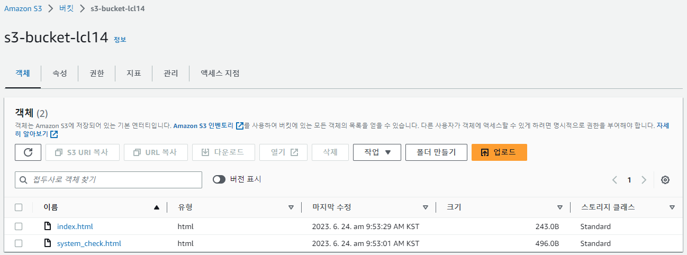

# S3

> [자습서: S3 객체 Lambda를 사용하여 애플리케이션의 데이터 변환](https://docs.aws.amazon.com/ko_kr/AmazonS3/latest/userguide/tutorial-s3-object-lambda-uppercase.html)  
> [자습서: Amazon S3에서 정적 웹 사이트 구성](https://docs.aws.amazon.com/ko_kr/AmazonS3/latest/userguide/HostingWebsiteOnS3Setup.html)  
> [AWS SDK를 사용한 Amazon S3용 코드 예제](https://docs.aws.amazon.com/ko_kr/AmazonS3/latest/userguide/service_code_examples.html)  
> [AWS SDK를 사용하여 Amazon S3 버킷에서 객체 가져오기](https://docs.aws.amazon.com/ko_kr/AmazonS3/latest/userguide/example_s3_GetObject_section.html)  
> [Access Denied when creating S3 Bucket ACL & S3 Policy using Terraform](https://stackoverflow.com/questions/76419099/access-denied-when-creating-s3-bucket-acl-s3-policy-using-terraform)  

- `s3-bucket-lcl14`
    

## AWS CLI 설정
```
$Env:AWS_PROFILE="lcl14" 
aws sts get-caller-identity
aws s3 ls   
```

### 실행 결과
```
PS > $Env:AWS_PROFILE="lcl14"                                            
PS > aws sts get-caller-identity
{
    "UserId": "**********",
    "Account": "123456789012",
    "Arn": "arn:aws:iam::123456789012:user/is07456"
}

PS > aws s3 ls      
2021-08-23 16:37:45 06117test
2023-03-27 16:57:55 07504
2023-02-15 11:28:53 07715
2022-01-18 13:53:31 09296
2021-08-20 12:47:03 2021-manual
2020-10-16 10:53:22 cf-templates-j0wmkf2x9giz-ap-northeast-1
2021-02-04 10:28:10 cf-templates-j0wmkf2x9giz-ap-northeast-2
2022-03-18 16:44:59 cf-templates-j0wmkf2x9giz-ap-northeast-3
2021-02-04 10:52:27 cf-templates-j0wmkf2x9giz-ap-southeast-1
2021-01-29 11:10:07 cf-templates-j0wmkf2x9giz-ap-southeast-2
2021-02-09 15:11:00 cf-templates-j0wmkf2x9giz-eu-central-1
2021-08-20 19:39:18 cf-templates-j0wmkf2x9giz-eu-north-1
2021-02-04 11:32:17 cf-templates-j0wmkf2x9giz-eu-west-1
2021-02-04 11:11:29 cf-templates-j0wmkf2x9giz-eu-west-2
2021-02-04 11:12:39 cf-templates-j0wmkf2x9giz-eu-west-3
2021-02-13 15:50:19 cf-templates-j0wmkf2x9giz-us-east-1
2021-02-04 11:22:56 cf-templates-j0wmkf2x9giz-us-east-2
2022-03-15 10:42:15 cf-templates-j0wmkf2x9giz-us-west-1
2021-02-09 15:54:22 cf-templates-j0wmkf2x9giz-us-west-2
2021-07-06 11:05:56 codepipeline-ap-northeast-2-27321304128
2022-08-28 15:37:40 codepipeline-ca-central-1-603466632248
2021-01-16 19:38:24 codepipeline-us-west-1-529228232559
2021-08-02 15:30:04 ds03440-s3
2020-10-23 11:05:05 ds05748
2021-06-21 13:45:11 ds07297
2021-08-13 18:02:21 ds09179
2023-03-04 20:05:35 ds09459
2023-03-27 17:25:48 ds10146
2022-01-13 16:27:07 edu-dev-an1-s3-mybucket-02863
2022-01-12 14:51:06 edu-dev-an2-s3-mybucket-05825
2022-01-19 15:58:41 edu-dev-an3-s3-mybucket-10356
2022-01-19 15:57:37 edu-dev-as1-s3-mybucket-09263
2022-01-20 17:59:52 edu-dev-as2-s3-mybucket-09003
2022-01-19 16:10:52 edu-dev-en1-s3-mybucket-07730
2022-01-12 14:51:03 edu-dev-s3-05374
2022-01-12 14:51:01 edu-dev-uw2-s3-05626
2022-01-12 14:51:01 edu-dev-uw2-s3-mybucket-08433
2023-01-09 14:39:28 eks-aws-config
2023-05-31 08:30:35 hello-world-dev-serverlessdeploymentbucket-k2zychu77wa3
2021-06-07 08:45:03 hky4076-util-bucket
2022-04-19 13:34:43 iac-initshell-s3
2021-01-19 14:57:53 infra-alb-log-tworld-online
2022-02-09 16:58:59 infra-hybridops-access-alb
2022-02-09 16:59:11 infra-hybridops-access-nlb
2021-01-18 17:33:19 infra-swing-mw
2023-06-21 15:59:12 is07297-a
2022-08-01 11:13:54 is08459
2021-11-15 17:08:54 is09263
2023-06-14 15:47:31 is10356-live-demo
2022-06-10 13:09:15 is10356-test-bucket
2023-01-10 14:48:26 psm-is10059
2021-04-26 11:27:57 resource-infra-data-d-ds07297
2020-06-29 20:37:44 s3-04232-redshift
2022-12-21 16:06:05 s3-05374iac-dev-velero-backup
2022-12-21 16:06:05 s3-05374iac-dev-velero-s3-logging
2022-10-31 16:50:04 s3-bizthink-prd-velero-backup
2022-10-31 16:50:04 s3-bizthink-prd-velero-s3-logging
2022-10-31 16:31:41 s3-bizthink-terraform-backend
2023-06-23 16:11:06 s3-bucket-lcl14
2021-11-02 17:29:55 s3-ds05374
2022-08-10 15:45:09 s3-finallab-tfstate-manage
2022-01-19 10:28:13 s3-is05834-test-kms
2022-01-19 14:20:00 s3-is05834-test-kms2
2022-01-19 10:15:13 s3-is05834-test-sse
2022-07-26 14:42:40 s3-jenkinspipeline-terraform-backend
2023-01-25 13:57:10 s3-origin-skcc-is-tf-07456
2023-01-25 10:34:37 s3-skcc-prd-cloudfront-is07456
2023-01-16 19:01:28 s3-skcc-prd-vpcflow-logs-is07456
2023-06-22 13:25:10 s3-terraform-is07456
2023-06-22 13:44:14 s3-terraform-lcl14
2021-06-21 19:59:57 s3-test-is05834
2023-01-17 04:56:32 s3-tf-p-velero-backup
2023-01-17 04:56:32 s3-tf-p-velero-s3-logging
2023-05-02 00:39:32 user10356-bucket-demo
PS > python s3-get-put-list.py
Bucket: 06117test, Creation Date: 2021-08-23 07:37:45+00:00
Bucket: 07504, Creation Date: 2023-03-27 07:57:55+00:00
Bucket: 07715, Creation Date: 2023-02-15 02:28:53+00:00
Bucket: 09296, Creation Date: 2022-01-18 04:53:31+00:00
Bucket: 2021-manual, Creation Date: 2021-08-20 03:47:03+00:00
Bucket: cf-templates-j0wmkf2x9giz-ap-northeast-1, Creation Date: 2020-10-16 01:53:22+00:00    
Bucket: cf-templates-j0wmkf2x9giz-ap-northeast-2, Creation Date: 2021-02-04 01:28:10+00:00    
Bucket: cf-templates-j0wmkf2x9giz-ap-northeast-3, Creation Date: 2022-03-18 07:44:59+00:00    
Bucket: cf-templates-j0wmkf2x9giz-ap-southeast-1, Creation Date: 2021-02-04 01:52:27+00:00    
Bucket: cf-templates-j0wmkf2x9giz-ap-southeast-2, Creation Date: 2021-01-29 02:10:07+00:00    
Bucket: cf-templates-j0wmkf2x9giz-eu-central-1, Creation Date: 2021-02-09 06:11:00+00:00      
Bucket: cf-templates-j0wmkf2x9giz-eu-north-1, Creation Date: 2021-08-20 10:39:18+00:00        
Bucket: cf-templates-j0wmkf2x9giz-eu-west-1, Creation Date: 2021-02-04 02:32:17+00:00
Bucket: cf-templates-j0wmkf2x9giz-eu-west-2, Creation Date: 2021-02-04 02:11:29+00:00
Bucket: cf-templates-j0wmkf2x9giz-eu-west-3, Creation Date: 2021-02-04 02:12:39+00:00
Bucket: cf-templates-j0wmkf2x9giz-us-east-1, Creation Date: 2021-02-13 06:50:19+00:00
Bucket: cf-templates-j0wmkf2x9giz-us-east-2, Creation Date: 2021-02-04 02:22:56+00:00
Bucket: cf-templates-j0wmkf2x9giz-us-west-1, Creation Date: 2022-03-15 01:42:15+00:00
Bucket: cf-templates-j0wmkf2x9giz-us-west-2, Creation Date: 2021-02-09 06:54:22+00:00
Bucket: codepipeline-ap-northeast-2-27321304128, Creation Date: 2021-07-06 02:05:56+00:00     
Bucket: codepipeline-ca-central-1-603466632248, Creation Date: 2022-08-28 06:37:40+00:00      
Bucket: codepipeline-us-west-1-529228232559, Creation Date: 2021-01-16 10:38:24+00:00
Bucket: ds03440-s3, Creation Date: 2021-08-02 06:30:04+00:00
Bucket: ds05748, Creation Date: 2020-10-23 02:05:05+00:00
Bucket: ds07297, Creation Date: 2021-06-21 04:45:11+00:00
Bucket: ds09179, Creation Date: 2021-08-13 09:02:21+00:00
Bucket: ds09459, Creation Date: 2023-03-04 11:05:35+00:00
Bucket: ds10146, Creation Date: 2023-03-27 08:25:48+00:00
Bucket: edu-dev-an1-s3-mybucket-02863, Creation Date: 2022-01-13 07:27:07+00:00
Bucket: edu-dev-an2-s3-mybucket-05825, Creation Date: 2022-01-12 05:51:06+00:00
Bucket: edu-dev-an3-s3-mybucket-10356, Creation Date: 2022-01-19 06:58:41+00:00
Bucket: edu-dev-as1-s3-mybucket-09263, Creation Date: 2022-01-19 06:57:37+00:00
Bucket: edu-dev-as2-s3-mybucket-09003, Creation Date: 2022-01-20 08:59:52+00:00
Bucket: edu-dev-en1-s3-mybucket-07730, Creation Date: 2022-01-19 07:10:52+00:00
Bucket: edu-dev-s3-05374, Creation Date: 2022-01-12 05:51:03+00:00
Bucket: edu-dev-uw2-s3-05626, Creation Date: 2022-01-12 05:51:01+00:00
Bucket: edu-dev-uw2-s3-mybucket-08433, Creation Date: 2022-01-12 05:51:01+00:00
Bucket: eks-aws-config, Creation Date: 2023-01-09 05:39:28+00:00
Bucket: hello-world-dev-serverlessdeploymentbucket-k2zychu77wa3, Creation Date: 2023-05-30 23:30:35+00:00
Bucket: hky4076-util-bucket, Creation Date: 2021-06-06 23:45:03+00:00
Bucket: iac-initshell-s3, Creation Date: 2022-04-19 04:34:43+00:00
Bucket: infra-alb-log-tworld-online, Creation Date: 2021-01-19 05:57:53+00:00
Bucket: infra-hybridops-access-alb, Creation Date: 2022-02-09 07:58:59+00:00
Bucket: infra-hybridops-access-nlb, Creation Date: 2022-02-09 07:59:11+00:00
Bucket: infra-swing-mw, Creation Date: 2021-01-18 08:33:19+00:00
Bucket: is07297-a, Creation Date: 2023-06-21 06:59:12+00:00
Bucket: is08459, Creation Date: 2022-08-01 02:13:54+00:00
Bucket: is09263, Creation Date: 2021-11-15 08:08:54+00:00
Bucket: is10356-live-demo, Creation Date: 2023-06-14 06:47:31+00:00
Bucket: is10356-test-bucket, Creation Date: 2022-06-10 04:09:15+00:00
Bucket: psm-is10059, Creation Date: 2023-01-10 05:48:26+00:00
Bucket: resource-infra-data-d-ds07297, Creation Date: 2021-04-26 02:27:57+00:00
Bucket: s3-04232-redshift, Creation Date: 2020-06-29 11:37:44+00:00
Bucket: s3-05374iac-dev-velero-backup, Creation Date: 2022-12-21 07:06:05+00:00
Bucket: s3-05374iac-dev-velero-s3-logging, Creation Date: 2022-12-21 07:06:05+00:00
Bucket: s3-bizthink-prd-velero-backup, Creation Date: 2022-10-31 07:50:04+00:00
Bucket: s3-bizthink-prd-velero-s3-logging, Creation Date: 2022-10-31 07:50:04+00:00
Bucket: s3-bizthink-terraform-backend, Creation Date: 2022-10-31 07:31:41+00:00
Bucket: s3-bucket-lcl14, Creation Date: 2023-06-25 10:44:49+00:00
Bucket: s3-ds05374, Creation Date: 2021-11-02 08:29:55+00:00
Bucket: s3-finallab-tfstate-manage, Creation Date: 2022-08-10 06:45:09+00:00
Bucket: s3-is05834-test-kms, Creation Date: 2022-01-19 01:28:13+00:00
Bucket: s3-is05834-test-kms2, Creation Date: 2022-01-19 05:20:00+00:00
Bucket: s3-is05834-test-sse, Creation Date: 2022-01-19 01:15:13+00:00
Bucket: s3-jenkinspipeline-terraform-backend, Creation Date: 2022-07-26 05:42:40+00:00        
Bucket: s3-origin-skcc-is-tf-07456, Creation Date: 2023-01-25 04:57:10+00:00
Bucket: s3-skcc-prd-cloudfront-is07456, Creation Date: 2023-01-25 01:34:37+00:00
Bucket: s3-skcc-prd-vpcflow-logs-is07456, Creation Date: 2023-01-16 10:01:28+00:00
Bucket: s3-terraform-is07456, Creation Date: 2023-06-22 04:25:10+00:00
Bucket: s3-terraform-lcl14, Creation Date: 2023-06-22 04:44:14+00:00
Bucket: s3-test-is05834, Creation Date: 2021-06-21 10:59:57+00:00
Bucket: s3-tf-p-velero-backup, Creation Date: 2023-01-16 19:56:32+00:00
Bucket: s3-tf-p-velero-s3-logging, Creation Date: 2023-01-16 19:56:32+00:00
Bucket: user10356-bucket-demo, Creation Date: 2023-05-01 15:39:32+00:00
index.html uploaded successfully.
Object Key: index.html, Size: 243 bytes, Last Modified: 2023-06-25 10:46:17+00:00
Object Key: system_check.html, Size: 897 bytes, Last Modified: 2023-06-27 05:19:05+00:00
index.html content:
<html>
<head>
    <title>Lambda Function Result</title>
    <meta charset="utf-8">
</head>
<body>
    <h1>The Lambda function has completed successfully.</h1>
    <p>The message text was:</p>
    <p>{message_text}</p>
</body>
</html>
index.html content:
<!DOCTYPE html>
<html>
<head>
    <title>Check System Report</title>
    <meta charset="utf-8">
    <style>
        table {
            border-collapse: collapse;
            width: 100%;
        }

        th, td {
            border: 1px solid #ddd;
            padding: 8px;
        }

        th {
            background-color: #f2f2f2;
        }

        .custom-table {
            width: 100%;
            border-collapse: collapse;
        }

        .custom-table th {
            background-color: #f2f2f2;
            padding: 10px;
            text-align: left;
        }

        .custom-table td {
            padding: 10px;
            border: 1px solid #ddd;
        }
    </style>
</head>
<body>
    <h1>Check System Report - {{date}}</h1>

    <h2>Argos System Check 결과</h2>
    {{table_content}}
</body>
</html>
PS >
```

## Python 
- `s3-get-put-list.py`
  - S3 bucket 목록을 보고, Bucket 안에 객체 목록을 출력하고, 버켓에 저장, 가져와 출력하는 예제
```
import boto3

def hello_s3():
    """
    Use the AWS SDK for Python (Boto3) to create an Amazon Simple Storage Service
    (Amazon S3) resource and list the buckets in your account.
    This example uses the default settings specified in your shared credentials
    and config files.
    """
    s3_resource = boto3.resource('s3')
    print("Hello, Amazon S3! Let's list your buckets:")
    for bucket in s3_resource.buckets.all():
        print(f"\t{bucket.name}")

if __name__ == '__main__':
    hello_s3()
```

```
PS > python s3-get-put-list.py
Bucket: 06117test, Creation Date: 2021-08-23 07:37:45+00:00
Bucket: 07504, Creation Date: 2023-03-27 07:57:55+00:00
Bucket: 07715, Creation Date: 2023-02-15 02:28:53+00:00
Bucket: 09296, Creation Date: 2022-01-18 04:53:31+00:00
Bucket: 2021-manual, Creation Date: 2021-08-20 03:47:03+00:00
Bucket: cf-templates-j0wmkf2x9giz-ap-northeast-1, Creation Date: 2020-10-16 01:53:22+00:00
Bucket: cf-templates-j0wmkf2x9giz-ap-northeast-2, Creation Date: 2021-02-04 01:28:10+00:00
Bucket: cf-templates-j0wmkf2x9giz-ap-northeast-3, Creation Date: 2022-03-18 07:44:59+00:00
Bucket: cf-templates-j0wmkf2x9giz-ap-southeast-1, Creation Date: 2021-02-04 01:52:27+00:00
Bucket: cf-templates-j0wmkf2x9giz-ap-southeast-2, Creation Date: 2021-01-29 02:10:07+00:00
Bucket: cf-templates-j0wmkf2x9giz-eu-central-1, Creation Date: 2021-02-09 06:11:00+00:00
Bucket: cf-templates-j0wmkf2x9giz-eu-north-1, Creation Date: 2021-08-20 10:39:18+00:00
Bucket: cf-templates-j0wmkf2x9giz-eu-west-1, Creation Date: 2021-02-04 02:32:17+00:00
Bucket: cf-templates-j0wmkf2x9giz-eu-west-2, Creation Date: 2021-02-04 02:11:29+00:00
Bucket: cf-templates-j0wmkf2x9giz-eu-west-3, Creation Date: 2021-02-04 02:12:39+00:00
Bucket: cf-templates-j0wmkf2x9giz-us-east-1, Creation Date: 2021-02-13 06:50:19+00:00
Bucket: cf-templates-j0wmkf2x9giz-us-east-2, Creation Date: 2021-02-04 02:22:56+00:00
Bucket: cf-templates-j0wmkf2x9giz-us-west-1, Creation Date: 2022-03-15 01:42:15+00:00
Bucket: cf-templates-j0wmkf2x9giz-us-west-2, Creation Date: 2021-02-09 06:54:22+00:00
Bucket: codepipeline-ap-northeast-2-27321304128, Creation Date: 2021-07-06 02:05:56+00:00
Bucket: codepipeline-ca-central-1-603466632248, Creation Date: 2022-08-28 06:37:40+00:00
Bucket: codepipeline-us-west-1-529228232559, Creation Date: 2021-01-16 10:38:24+00:00
Bucket: ds03440-s3, Creation Date: 2021-08-02 06:30:04+00:00
Bucket: ds05748, Creation Date: 2020-10-23 02:05:05+00:00
Bucket: ds07297, Creation Date: 2021-06-21 04:45:11+00:00
Bucket: ds09179, Creation Date: 2021-08-13 09:02:21+00:00
Bucket: ds09459, Creation Date: 2023-03-04 11:05:35+00:00
Bucket: ds10146, Creation Date: 2023-03-27 08:25:48+00:00
Bucket: edu-dev-an1-s3-mybucket-02863, Creation Date: 2022-01-13 07:27:07+00:00
Bucket: edu-dev-an2-s3-mybucket-05825, Creation Date: 2022-01-12 05:51:06+00:00
Bucket: edu-dev-an3-s3-mybucket-10356, Creation Date: 2022-01-19 06:58:41+00:00
Bucket: edu-dev-as1-s3-mybucket-09263, Creation Date: 2022-01-19 06:57:37+00:00
Bucket: edu-dev-as2-s3-mybucket-09003, Creation Date: 2022-01-20 08:59:52+00:00
Bucket: edu-dev-en1-s3-mybucket-07730, Creation Date: 2022-01-19 07:10:52+00:00
Bucket: edu-dev-s3-05374, Creation Date: 2022-01-12 05:51:03+00:00
Bucket: edu-dev-uw2-s3-05626, Creation Date: 2022-01-12 05:51:01+00:00
Bucket: edu-dev-uw2-s3-mybucket-08433, Creation Date: 2022-01-12 05:51:01+00:00
Bucket: eks-aws-config, Creation Date: 2023-01-09 05:39:28+00:00
Bucket: hello-world-dev-serverlessdeploymentbucket-k2zychu77wa3, Creation Date: 2023-05-30 23:30:35+00:00
Bucket: hky4076-util-bucket, Creation Date: 2021-06-06 23:45:03+00:00
Bucket: iac-initshell-s3, Creation Date: 2022-04-19 04:34:43+00:00
Bucket: infra-alb-log-tworld-online, Creation Date: 2021-01-19 05:57:53+00:00
Bucket: infra-hybridops-access-alb, Creation Date: 2022-02-09 07:58:59+00:00
Bucket: infra-hybridops-access-nlb, Creation Date: 2022-02-09 07:59:11+00:00
Bucket: infra-swing-mw, Creation Date: 2021-01-18 08:33:19+00:00
Bucket: is07297-a, Creation Date: 2023-06-21 06:59:12+00:00
Bucket: is08459, Creation Date: 2022-08-01 02:13:54+00:00
Bucket: is09263, Creation Date: 2021-11-15 08:08:54+00:00
Bucket: is10356-live-demo, Creation Date: 2023-06-14 06:47:31+00:00
Bucket: is10356-test-bucket, Creation Date: 2022-06-10 04:09:15+00:00
Bucket: psm-is10059, Creation Date: 2023-01-10 05:48:26+00:00
Bucket: resource-infra-data-d-ds07297, Creation Date: 2021-04-26 02:27:57+00:00
Bucket: s3-04232-redshift, Creation Date: 2020-06-29 11:37:44+00:00
Bucket: s3-05374iac-dev-velero-backup, Creation Date: 2022-12-21 07:06:05+00:00
Bucket: s3-05374iac-dev-velero-s3-logging, Creation Date: 2022-12-21 07:06:05+00:00
Bucket: s3-bizthink-prd-velero-backup, Creation Date: 2022-10-31 07:50:04+00:00
Bucket: s3-bizthink-prd-velero-s3-logging, Creation Date: 2022-10-31 07:50:04+00:00
Bucket: s3-bizthink-terraform-backend, Creation Date: 2022-10-31 07:31:41+00:00
Bucket: s3-bucket-lcl14, Creation Date: 2023-06-23 07:11:06+00:00
Bucket: s3-ds05374, Creation Date: 2021-11-02 08:29:55+00:00
Bucket: s3-finallab-tfstate-manage, Creation Date: 2022-08-10 06:45:09+00:00
Bucket: s3-is05834-test-kms, Creation Date: 2022-01-19 01:28:13+00:00
Bucket: s3-is05834-test-kms2, Creation Date: 2022-01-19 05:20:00+00:00
Bucket: s3-is05834-test-sse, Creation Date: 2022-01-19 01:15:13+00:00
Bucket: s3-jenkinspipeline-terraform-backend, Creation Date: 2022-07-26 05:42:40+00:00
Bucket: s3-origin-skcc-is-tf-07456, Creation Date: 2023-01-25 04:57:10+00:00
Bucket: s3-skcc-prd-cloudfront-is07456, Creation Date: 2023-01-25 01:34:37+00:00
Bucket: s3-skcc-prd-vpcflow-logs-is07456, Creation Date: 2023-01-16 10:01:28+00:00
Bucket: s3-terraform-is07456, Creation Date: 2023-06-22 04:25:10+00:00
Bucket: s3-terraform-lcl14, Creation Date: 2023-06-22 04:44:14+00:00
Bucket: s3-test-is05834, Creation Date: 2021-06-21 10:59:57+00:00
Bucket: s3-tf-p-velero-backup, Creation Date: 2023-01-16 19:56:32+00:00
Bucket: s3-tf-p-velero-s3-logging, Creation Date: 2023-01-16 19:56:32+00:00
Bucket: user10356-bucket-demo, Creation Date: 2023-05-01 15:39:32+00:00
Object Key: index.html, Size: 243 bytes, Last Modified: 2023-06-23 07:32:16+00:00
index.html uploaded successfully.
Object Key: index.html, Size: 243 bytes, Last Modified: 2023-06-23 07:33:51+00:00
index.html content:
<html>
<head>
    <title>Lambda Function Result</title>
    <meta charset="utf-8">
</head>
<body>
    <h1>The Lambda function has completed successfully.</h1>
    <p>The message text was:</p>
    <p>{message_text}</p>
</body>
</html>
PS > 
```

## terraform
### terraform init
```
PS > terraform init  

Initializing the backend...

Successfully configured the backend "s3"! Terraform will automatically
use this backend unless the backend configuration changes.

Initializing provider plugins...
- Finding hashicorp/aws versions matching ">= 3.50.0"...
- Installing hashicorp/aws v5.5.0...
- Installed hashicorp/aws v5.5.0 (signed by HashiCorp)

Terraform has created a lock file .terraform.lock.hcl to record the provider
selections it made above. Include this file in your version control repository
so that Terraform can guarantee to make the same selections by default when
you run "terraform init" in the future.

Terraform has been successfully initialized!

You may now begin working with Terraform. Try running "terraform plan" to see
any changes that are required for your infrastructure. All Terraform commands
should now work.

If you ever set or change modules or backend configuration for Terraform,
rerun this command to reinitialize your working directory. If you forget, other
commands will detect it and remind you to do so if necessary.
PS > 
```

### terraform plan
```
PS > terraform plan
data.aws_caller_identity.current: Reading...
data.aws_iam_policy_document.s3-bucket-policy-document: Reading...
data.aws_iam_policy_document.s3-bucket-policy-document: Read complete after 0s [id=89131574]
data.aws_caller_identity.current: Read complete after 0s [id=123456789012]

Terraform used the selected providers to generate the following execution plan. Resource actions are       
indicated with the following symbols:
  + create

Terraform will perform the following actions:

  # aws_s3_bucket.s3_bucket will be created
  + resource "aws_s3_bucket" "s3_bucket" {
      + acceleration_status         = (known after apply)
      + acl                         = (known after apply)
      + arn                         = (known after apply)
      + bucket                      = "s3-bucket-lcl14"
      + bucket_domain_name          = (known after apply)
      + bucket_prefix               = (known after apply)
      + bucket_regional_domain_name = (known after apply)
      + force_destroy               = false
      + hosted_zone_id              = (known after apply)
      + id                          = (known after apply)
      + object_lock_enabled         = true
      + policy                      = (known after apply)
      + region                      = (known after apply)
      + request_payer               = (known after apply)
      + tags                        = {
          + "Name" = "s3-bucket-lcl14"
        }
      + tags_all                    = {
          + "Environment"         = "prd"
          + "Name"                = "s3-bucket-lcl14"
          + "Personalinformation" = "no"
          + "ServiceName"         = "lcl14"
          + "owner"               = "lcl14"
        }
      + website_domain              = (known after apply)
      + website_endpoint            = (known after apply)
    }

  # aws_s3_bucket_acl.s3_bucket_acl will be created
  + resource "aws_s3_bucket_acl" "s3_bucket_acl" {
      + acl    = "public-read"
      + bucket = (known after apply)
      + id     = (known after apply)
    }

  # aws_s3_bucket_lifecycle_configuration.lifecycle_configuration will be created
  + resource "aws_s3_bucket_lifecycle_configuration" "lifecycle_configuration" {
      + bucket = (known after apply)
      + id     = (known after apply)

      + rule {
          + id     = "log"
          + status = "Enabled"

          + expiration {
              + days                         = 90
              + expired_object_delete_marker = (known after apply)
            }

          + filter {
              + and {
                  + prefix = "log/"
                  + tags   = {
                      + "autoclean" = "true"
                      + "rule"      = "log"
                    }
                }
            }

          + transition {
              + days          = 30
              + storage_class = "STANDARD_IA"
            }
          + transition {
              + days          = 60
              + storage_class = "GLACIER"
            }
        }
      + rule {
          + id     = "tmp"
          + status = "Enabled"

          + expiration {
              + date                         = "2023-01-13T00:00:00Z"
              + days                         = 0
              + expired_object_delete_marker = (known after apply)
            }

          + filter {
              + prefix = "tmp/"
            }
        }
    }

  # aws_s3_bucket_ownership_controls.s3_bucket_acl_ownership will be created
  + resource "aws_s3_bucket_ownership_controls" "s3_bucket_acl_ownership" {
      + bucket = (known after apply)
      + id     = (known after apply)

      + rule {
          + object_ownership = "BucketOwnerPreferred"
        }
    }

  # aws_s3_bucket_policy.s3-bucket-policy will be created
  + resource "aws_s3_bucket_policy" "s3-bucket-policy" {
      + bucket = (known after apply)
      + id     = (known after apply)
      + policy = jsonencode(
            {
              + Statement = [
                  + {
                      + Action    = "s3:PutObject"
                      + Effect    = "Allow"
                      + Principal = {
                          + Service = "logging.s3.amazonaws.com"
                        }
                      + Resource  = "arn:aws:s3:::s3-bucket-lcl14/*"
                      + Sid       = "S3PolicyStmt-LCL14-AccessLogging"
                    },
                  + {
                      + Action    = [
                          + "s3:ListBucket",
                          + "s3:GetObject",
                        ]
                      + Effect    = "Allow"
                      + Principal = {
                          + AWS = "*"
                        }
                      + Resource  = [
                          + "arn:aws:s3:::s3-bucket-lcl14/*",
                          + "arn:aws:s3:::s3-bucket-lcl14",
                        ]
                      + Sid       = "S3PolicyStmt-LCL14-PublicAccess"
                    },
                ]
              + Version   = "2012-10-17"
            }
        )
    }

  # aws_s3_bucket_public_access_block.s3_bucket_public_access will be created
  + resource "aws_s3_bucket_public_access_block" "s3_bucket_public_access" {
      + block_public_acls       = false
      + block_public_policy     = false
      + bucket                  = "s3-bucket-lcl14"
      + id                      = (known after apply)
      + ignore_public_acls      = false
      + restrict_public_buckets = false
    }

  # aws_s3_bucket_server_side_encryption_configuration.s3_enc will be created
  + resource "aws_s3_bucket_server_side_encryption_configuration" "s3_enc" {
      + bucket = "s3-bucket-lcl14"
      + id     = (known after apply)

      + rule {
          + apply_server_side_encryption_by_default {
              + sse_algorithm = "AES256"
            }
        }
    }

  # aws_s3_bucket_versioning.s3_ver will be created
  + resource "aws_s3_bucket_versioning" "s3_ver" {
      + bucket = "s3-bucket-lcl14"
      + id     = (known after apply)

      + versioning_configuration {
          + mfa_delete = (known after apply)
          + status     = "Enabled"
        }
    }

  # aws_s3_object.file_objects["template/index.html"] will be created
  + resource "aws_s3_object" "file_objects" {
      + bucket                 = (known after apply)
      + bucket_key_enabled     = (known after apply)
      + content_type           = "text/html"
      + etag                   = "3db086ac27d2a98c6bc1fd87b5923cda"
      + force_destroy          = false
      + id                     = (known after apply)
      + key                    = "index.html"
      + kms_key_id             = (known after apply)
      + server_side_encryption = (known after apply)
      + source                 = "template/index.html"
      + storage_class          = (known after apply)
      + tags_all               = {
          + "Environment"         = "prd"
          + "Personalinformation" = "no"
          + "ServiceName"         = "lcl14"
          + "owner"               = "lcl14"
        }
      + version_id             = (known after apply)
    }

  # aws_s3_object.file_objects["template/resource_check.html"] will be created
  + resource "aws_s3_object" "file_objects" {
      + bucket                 = (known after apply)
      + bucket_key_enabled     = (known after apply)
      + content_type           = "text/html"
      + etag                   = "1f457673842fb53c1da570a764cdfc4b"
      + force_destroy          = false
      + id                     = (known after apply)
      + key                    = "resource_check.html"
      + kms_key_id             = (known after apply)
      + server_side_encryption = (known after apply)
      + source                 = "template/resource_check.html"
      + storage_class          = (known after apply)
      + tags_all               = {
          + "Environment"         = "prd"
          + "Personalinformation" = "no"
          + "ServiceName"         = "lcl14"
          + "owner"               = "lcl14"
        }
      + version_id             = (known after apply)
    }

  # aws_s3_object.file_objects["template/system_check.html"] will be created
  + resource "aws_s3_object" "file_objects" {
      + bucket                 = (known after apply)
      + bucket_key_enabled     = (known after apply)
      + content_type           = "text/html"
      + etag                   = "054b1dae3011ab7d54550e3acb8413e8"
      + force_destroy          = false
      + id                     = (known after apply)
      + key                    = "system_check.html"
      + kms_key_id             = (known after apply)
      + server_side_encryption = (known after apply)
      + source                 = "template/system_check.html"
      + storage_class          = (known after apply)
      + tags_all               = {
          + "Environment"         = "prd"
          + "Personalinformation" = "no"
          + "ServiceName"         = "lcl14"
          + "owner"               = "lcl14"
        }
      + version_id             = (known after apply)
    }

Plan: 11 to add, 0 to change, 0 to destroy.

Changes to Outputs:
  + s3_bucket_name   = "s3-bucket-lcl14"
  + uploaded_objects = [
      + {
          + key = "index.html"
        },
      + {
          + key = "resource_check.html"
        },
      + {
          + key = "system_check.html"
        },
    ]

────────────────────────────────────────────────────────────────────────────────────────────────────────── 

Note: You didn't use the -out option to save this plan, so Terraform can't guarantee to take exactly these 
actions if you run "terraform apply" now.
PS > 
```

### terraform apply
```
PS > terraform apply
data.aws_caller_identity.current: Reading...
data.aws_iam_policy_document.s3-application-accesslogging-policy-document: Reading...
data.aws_iam_policy_document.s3-application-accesslogging-policy-document: Read complete after 0s [id=3418356696]
data.aws_caller_identity.current: Read complete after 0s [id=123456789012]

Terraform used the selected providers to generate the following execution plan. Resource actions are indicated with the
following symbols:
  + create

Terraform will perform the following actions:

  # aws_s3_bucket.s3_bucket will be created
  + resource "aws_s3_bucket" "s3_bucket" {
      + acceleration_status         = (known after apply)
      + acl                         = (known after apply)
      + arn                         = (known after apply)
      + bucket                      = "s3-bucket-lcl14"
      + bucket_domain_name          = (known after apply)
      + bucket_prefix               = (known after apply)
      + bucket_regional_domain_name = (known after apply)
      + force_destroy               = false
      + hosted_zone_id              = (known after apply)
      + id                          = (known after apply)
      + object_lock_enabled         = true
      + policy                      = (known after apply)
      + region                      = (known after apply)
      + request_payer               = (known after apply)
      + tags                        = {
          + "Name" = "s3-bucket-lcl14"
        }
      + tags_all                    = {
          + "Environment"         = "prd"
          + "Name"                = "s3-bucket-lcl14"
          + "Personalinformation" = "no"
          + "ServiceName"         = "lcl14"
          + "owner"               = "lcl14"
        }
      + website_domain              = (known after apply)
      + website_endpoint            = (known after apply)

      + cors_rule {
          + allowed_headers = (known after apply)
          + allowed_methods = (known after apply)
          + allowed_origins = (known after apply)
          + expose_headers  = (known after apply)
          + max_age_seconds = (known after apply)
        }

      + grant {
          + id          = (known after apply)
          + permissions = (known after apply)
          + type        = (known after apply)
          + uri         = (known after apply)
        }

      + lifecycle_rule {
          + abort_incomplete_multipart_upload_days = (known after apply)
          + enabled                                = (known after apply)
          + id                                     = (known after apply)
          + prefix                                 = (known after apply)
          + tags                                   = (known after apply)

          + expiration {
              + date                         = (known after apply)
              + days                         = (known after apply)
              + expired_object_delete_marker = (known after apply)
            }

          + noncurrent_version_expiration {
              + days = (known after apply)
            }

          + noncurrent_version_transition {
              + days          = (known after apply)
              + storage_class = (known after apply)
            }

          + transition {
              + date          = (known after apply)
              + days          = (known after apply)
              + storage_class = (known after apply)
            }
        }

      + logging {
          + target_bucket = (known after apply)
          + target_prefix = (known after apply)
        }

      + object_lock_configuration {
          + object_lock_enabled = (known after apply)

          + rule {
              + default_retention {
                  + days  = (known after apply)
                  + mode  = (known after apply)
                  + years = (known after apply)
                }
            }
        }

      + replication_configuration {
          + role = (known after apply)

          + rules {
              + delete_marker_replication_status = (known after apply)
              + id                               = (known after apply)
              + prefix                           = (known after apply)
              + priority                         = (known after apply)
              + status                           = (known after apply)

              + destination {
                  + account_id         = (known after apply)
                  + bucket             = (known after apply)
                  + replica_kms_key_id = (known after apply)
                  + storage_class      = (known after apply)

                  + access_control_translation {
                      + owner = (known after apply)
                    }

                  + metrics {
                      + minutes = (known after apply)
                      + status  = (known after apply)
                    }

                  + replication_time {
                      + minutes = (known after apply)
                      + status  = (known after apply)
                    }
                }

              + filter {
                  + prefix = (known after apply)
                  + tags   = (known after apply)
                }

              + source_selection_criteria {
                  + sse_kms_encrypted_objects {
                      + enabled = (known after apply)
                    }
                }
            }
        }

      + server_side_encryption_configuration {
          + rule {
              + bucket_key_enabled = (known after apply)

              + apply_server_side_encryption_by_default {
                  + kms_master_key_id = (known after apply)
                  + sse_algorithm     = (known after apply)
                }
            }
        }

      + versioning {
          + enabled    = (known after apply)
          + mfa_delete = (known after apply)
        }

      + website {
          + error_document           = (known after apply)
          + index_document           = (known after apply)
          + redirect_all_requests_to = (known after apply)
          + routing_rules            = (known after apply)
        }
    }

  # aws_s3_bucket_acl.s3_bucket_acl will be created
  + resource "aws_s3_bucket_acl" "s3_bucket_acl" {
      + acl    = "private"
      + bucket = (known after apply)
      + id     = (known after apply)

      + access_control_policy {
          + grant {
              + permission = (known after apply)

              + grantee {
                  + display_name  = (known after apply)
                  + email_address = (known after apply)
                  + id            = (known after apply)
                  + type          = (known after apply)
                  + uri           = (known after apply)
                }
            }

          + owner {
              + display_name = (known after apply)
              + id           = (known after apply)
            }
        }
    }

  # aws_s3_bucket_ownership_controls.s3_bucket_acl_ownership will be created
  + resource "aws_s3_bucket_ownership_controls" "s3_bucket_acl_ownership" {
      + bucket = (known after apply)
      + id     = (known after apply)

      + rule {
          + object_ownership = "BucketOwnerPreferred"
        }
    }

  # aws_s3_bucket_policy.s3-bucket-policy will be created
  + resource "aws_s3_bucket_policy" "s3-bucket-policy" {
      + bucket = (known after apply)
      + id     = (known after apply)
      + policy = jsonencode(
            {
              + Statement = [
                  + {
                      + Action    = "s3:PutObject"
                      + Effect    = "Allow"
                      + Principal = {
                          + Service = "logging.s3.amazonaws.com"
                        }
                      + Resource  = "arn:aws:s3:::s3-bucket-lcl14/*"
                      + Sid       = "S3PolicyStmt-DO-NOT-MODIFY-1648028110465"
                    },
                ]
              + Version   = "2012-10-17"
            }
        )
    }

  # aws_s3_bucket_server_side_encryption_configuration.s3_enc will be created
  + resource "aws_s3_bucket_server_side_encryption_configuration" "s3_enc" {
      + bucket = "s3-bucket-lcl14"
      + id     = (known after apply)

      + rule {
          + apply_server_side_encryption_by_default {
              + sse_algorithm = "AES256"
            }
        }
    }

  # aws_s3_bucket_versioning.s3_ver will be created
  + resource "aws_s3_bucket_versioning" "s3_ver" {
      + bucket = "s3-bucket-lcl14"
      + id     = (known after apply)

      + versioning_configuration {
          + mfa_delete = (known after apply)
          + status     = "Enabled"
        }
    }

Plan: 6 to add, 0 to change, 0 to destroy.

Do you want to perform these actions?
  Terraform will perform the actions described above.
  Only 'yes' will be accepted to approve.

  Enter a value: yes

aws_s3_bucket.s3_bucket: Creating...
aws_s3_bucket.s3_bucket: Creation complete after 1s [id=s3-bucket-lcl14]
aws_s3_bucket_ownership_controls.s3_bucket_acl_ownership: Creating...
aws_s3_bucket_policy.s3-bucket-policy: Creating...
aws_s3_bucket_versioning.s3_ver: Creating...
aws_s3_bucket_server_side_encryption_configuration.s3_enc: Creating...
aws_s3_bucket_policy.s3-bucket-policy: Creation complete after 1s [id=s3-bucket-lcl14]
aws_s3_bucket_server_side_encryption_configuration.s3_enc: Creation complete after 2s [id=s3-bucket-lcl14]
aws_s3_bucket_versioning.s3_ver: Creation complete after 2s [id=s3-bucket-lcl14]
aws_s3_bucket_ownership_controls.s3_bucket_acl_ownership: Creation complete after 3s [id=s3-bucket-lcl14]
aws_s3_bucket_acl.s3_bucket_acl: Creating...
aws_s3_bucket_acl.s3_bucket_acl: Creation complete after 0s [id=s3-bucket-lcl14,private]

Apply complete! Resources: 6 added, 0 changed, 0 destroyed.
PS > 
```
