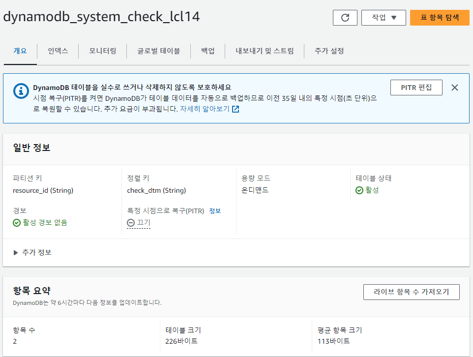
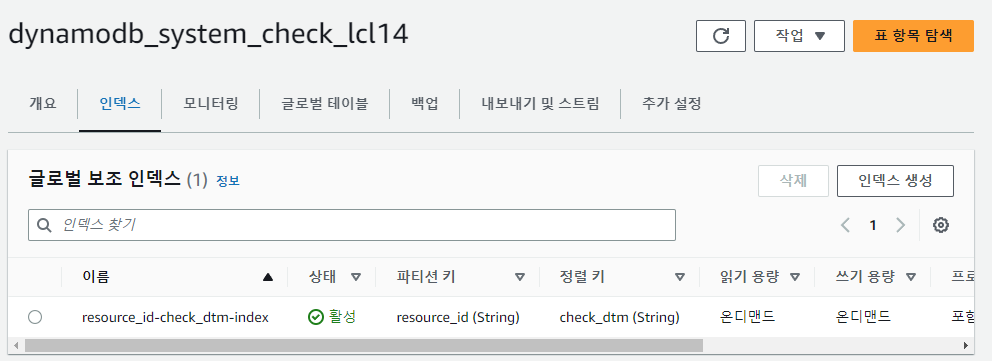

# DynamoDB

> [How to Create Amazon DynamoDB Tables in AWS with Terraform](https://gmusumeci.medium.com/how-to-create-amazon-dynamodb-tables-in-aws-with-terraform-aff8e49e3c21)  
> [aws_dynamodb_table](https://runebook.dev/ko/docs/terraform/providers/aws/r/dynamodb_table)  
> [DynamoDB에서 단일 항목 읽기 및 쓰기](https://docs.aws.amazon.com/ko_kr/sdk-for-javascript/v2/developer-guide/dynamodb-example-table-read-write.html)  
> [Python (Boto3) 을 이용한 DynamoDB 예제](https://docs.aws.amazon.com/ko_kr/code-library/latest/ug/python_3_dynamodb_code_examples.html)  
> [Professional GUI Client for DynamoDB -  7-day free trial](https://dynobase.dev/)  
> [Amazon DynamoDB용 NoSQL Workbench가 정식 출시되었습니다.](https://aws.amazon.com/ko/about-aws/whats-new/2020/03/nosql-workbench-for-amazon-dynamodb-is-now-generally-available/)  
> [Download *NoSQL Workbench for DynamoDB*](https://docs.aws.amazon.com/amazondynamodb/latest/developerguide/workbench.settingup.html)  
> [Amazon DynamoDB용 NoSQL Workbench 다운로드](https://docs.aws.amazon.com/ko_kr/amazondynamodb/latest/developerguide/workbench.settingup.html)  
> [Amazon DynamoDB용 NoSQL Workbench 다운로드 - Windows](https://s3.amazonaws.com/nosql-workbench/WorkbenchDDBLocal-win.exe)  
> [A GUI for Local DynamoDB— dynamodb-admin](https://medium.com/swlh/a-gui-for-local-dynamodb-dynamodb-admin-b16998323f8e)  
> [DynamoDb-GUI-Client](https://github.com/Arattian/DynamoDb-GUI-Client)  

## Table - system_check 테이블
- 매일 점검 스크립트 수정 후 테이블에 적재
- UI 에서 조회 시 점검자원ID + 점검일자 begin_with 조회일자 + 조회일자 역순의 1행 검색(해당 일자의 최신 점검 결과 조회)

| field 명 | 설명 | 속성 |  
|:---|:---|:---|  
| check_dtm | 점검일시분초 | 정렬키 (hash key)  |  
| resource_id | 점검 자원 ID | 파티션 키 (range key) |  
| check_result | 점검 결과 | `Y` 양호 </br> `C` 확인 필요 </br> `N` 불량 |  
| check_result_detail | 상세 결과 값 | |  


### `dydb_alert_history_lcl14`
| field 명 | 설명 | 속성 |  
|:---|:---|:---|  
| date | 점검일시분초 | 정렬키 (hash key)  |  
| id | 발생한 Alert ID의 Unique 값 | 파티션 키 (range key) |  
| alert_id | Datadog alert id | |  
| payload | 상세 결과 값 | |  

#### 당일 alert 발생 개수 보기
> [dynamodb-alert-list.py](./dynamodb-alert-list.py)
```
PS > $Env:AWS_PROFILE="lcl14"
PS > python dynamodb-alert-list.py
Priority: P4, Count: 4
Priority: P5, Count: 4
PS > 
```


※ 테이블 생성시는 파티션키와 정렬키만 만듬

  
  

## Partition Key와 Sort Key
- 복합 기본 키로 지칭되는 이 형식의 키는 두 개의 속성으로 구성됩니다. 첫 번째 속성은 파티션 키이고, 두 번째 속성은 정렬 키.입니다.
- 파티션 키는 중복 가능, 정렬 키는 유일해야 한다.
### 파티션키(Partition Key)
- 물리적인 공간을 파티션
- Terraform : hash key
- Scale 이 아무리 커져도 주소를 알고 있어서 빠르게 가져올 수 있음
- 파티션키로는 일치하는 값만 가져올 수 있고, 조건문으로 작성할 수 없음

### 정렬키(Sort Key)
- 파티션 내에서 정렬하는 기준
- 검색을 위한 최소의 조건
- Number, Binary, String Type 지원
  - String 의 경우 UTF-8 으로 기준으로 정렬
- 단순한 (문자열) 인덱스
- 단순정렬이기 때문에 파티션의 사이즈가 커도 빠르게 가져올 수 있음
  - eq, lt, gt 등의 비교 조건과 between, begin_with 만 지원


## AWS CLI
```
$Env:AWS_PROFILE="lcl14"
aws sts get-caller-identity
aws dynamodb list-tables  
aws dynamodb scan --table-name dynamodb_system_check_lcl14
aws dynamodb get-item --table-name <테이블명> --key '{"<파티션키>": {"<데이터타입>": "<파티션키값>"}, "<정렬키>": {"<데이터타입>": "<정렬키값>"}}'
aws dynamodb query --table-name <테이블명> --key-condition-expression "<파티션키> = :val" --expression-attribute-values '{":val": {"<데이터타입>": "<파티션키값>"}}'

```

#### 스키마 보기
```
aws dynamodb describe-table --table-name dynamodb_system_check_lcl14
```
##### 실행 결과
```
PS > aws dynamodb describe-table --table-name dynamodb_system_check_lcl14
{
    "Table": {
        "AttributeDefinitions": [
            {
                "AttributeName": "check_dtm",
                "AttributeType": "S"
            },
            {
                "AttributeName": "resource_id",
                "AttributeType": "S"
            }
        ],
        "TableName": "dynamodb_system_check_lcl14",
        "KeySchema": [
            {
                "AttributeName": "resource_id",
                "KeyType": "HASH"
            },
            {
                "AttributeName": "check_dtm",
                "KeyType": "RANGE"
            }
        ],
        "TableStatus": "ACTIVE",
        "CreationDateTime": "2023-06-23T18:13:54.349000+09:00",
        "ProvisionedThroughput": {
            "NumberOfDecreasesToday": 0,
            "ReadCapacityUnits": 0,
            "WriteCapacityUnits": 0
        },
        "TableSizeBytes": 163510,
        "ItemCount": 102,
        "TableArn": "arn:aws:dynamodb:ap-northeast-2:123456789012:table/dynamodb_system_check_lcl14",
        "TableId": "a21ccace-3fb3-40c2-bcb4-b379a93bec5c",
        "BillingModeSummary": {
            "BillingMode": "PAY_PER_REQUEST",
            "LastUpdateToPayPerRequestDateTime": "2023-06-23T18:13:54.349000+09:00"
        },
        "GlobalSecondaryIndexes": [
            {
                "IndexName": "resource_id-check_dtm-index",
                "KeySchema": [
                    {
                        "AttributeName": "resource_id",
                        "KeyType": "HASH"
                    },
                    {
                        "AttributeName": "check_dtm",
                        "KeyType": "RANGE"
                    }
                ],
                "Projection": {
                    "ProjectionType": "INCLUDE",
                    "NonKeyAttributes": [
                        "check_result_detail"
                    ]
                },
                "IndexStatus": "ACTIVE",
                "ProvisionedThroughput": {
                    "NumberOfDecreasesToday": 0,
                    "ReadCapacityUnits": 0,
                    "WriteCapacityUnits": 0
                },
                "IndexSizeBytes": 162178,
                "ItemCount": 102,
                "IndexArn": "arn:aws:dynamodb:ap-northeast-2:123456789012:table/dynamodb_system_check_lcl14/index/resource_id-check_dtm-index"
            }
        ],
        "StreamSpecification": {
            "StreamEnabled": true,
            "StreamViewType": "NEW_AND_OLD_IMAGES"
        },
        "LatestStreamLabel": "2023-06-23T09:13:54.349",
        "LatestStreamArn": "arn:aws:dynamodb:ap-northeast-2:123456789012:table/dynamodb_system_check_lcl14/stream/2023-06-23T09:13:54.349",
        "DeletionProtectionEnabled": false
    }
}

PS >  
```

#### 삭제
```
aws dynamodb delete-item `
    --table-name dynamodb_system_check_lcl14 `
    --key '{"resource_id": {"S": "1"}, "check_dtm": {"S": "<check_dtm_value>"}}'
```
```
aws dynamodb delete-item `
    --table-name dynamodb_system_check_lcl14 `
    --filter-expression "contains(check_dtm, :check_dtm_value)" `
    --expression-attribute-values '{":check_dtm_value": {"S": "20230623"}}'

```


### 실행결과
```
PS > $Env:AWS_PROFILE="lcl14"
PS > aws sts get-caller-identity
{
    "UserId": "**********",
    "Account": "123456789012",
    "Arn": "arn:aws:iam::123456789012:user/is07456"
}

PS > aws dynamodb list-tables  
{
    "TableNames": [
        "AHA-DynamoDBTable-xm79bb88",
        "dydb-terraform-lcl14",
        "dynamodb-finallab-terraform-lock",
        "dynamodb_system_check_lcl14",
        "eks-workshop-carts"
    ]
}

PS > aws dynamodb scan --table-name dynamodb_system_check_lcl14
{
    "Items": [],
    "Count": 0,
    "ScannedCount": 0,
    "ConsumedCapacity": null
}
.
.
.
PS > aws dynamodb scan --table-name dynamodb_system_check_lcl14
{
    "Items": [
        {
            "resource_id": {
                "S": "1"
            },
            "check_result_detail": {
                "S": "{\"key1\": \"value1\", \"key2\": \"value2\"}"
            },
            "check_dtm": {
                "S": "20230623 192336"
            },
            "check_result": {
                "S": "Y"
            }
        },
        {
            "resource_id": {
                "S": "example_resource_id"
            },
            "check_result_detail": {
                "S": "{\"detail_key\": \"detail_value\"}"
            },
            "check_dtm": {
                "S": "20230623 191434"
            },
            "check_result": {
                "S": "success"
            }
        }
    ],
    "Count": 2,
    "ScannedCount": 2,
    "ConsumedCapacity": null
}
```

#### python 코드 실행 결과
```
PS > python dynamodb-list.py        
테이블 이름: AHA-DynamoDBTable-xm79bb88, 생성일자: 2023-02-02 11:18:47
테이블 이름: dydb-terraform-lcl14, 생성일자: 2023-06-22 13:44:09
테이블 이름: dynamodb-finallab-terraform-lock, 생성일자: 2022-08-10 15:48:34
테이블 이름: dynamodb_system_check_lcl14, 생성일자: 2023-06-23 18:13:54
테이블 이름: eks-workshop-carts, 생성일자: 2023-05-25 16:56:02
PS > python dynamodb-put-item.py
데이터 삽입이 성공적으로 완료되었습니다.
PS > python dynamodb-get-item.py
아이템 조회 결과:
resource_id: 1
check_dtm: 20230623 192336
check_result: Y
check_result_detail: {'key1': 'value1', 'key2': 'value2'}
PS > python dynamodb-get-put-list.py
{'resource_id': {'S': 'example_resource_id'}, 'check_result_detail': {'S': '{"detail_key": "detail_value"}'}, 'check_dtm': {'S': '20230623 191434'}, 'check_result': {'S': 'success'}}
{'resource_id': {'S': 'example_resource_id'}, 'check_result_detail': {'S': '{"detail_key": "detail_value"}'}, 'check_dtm': {'S': '20230623 191434'}, 'check_result': {'S': 'success'}}
PS > python dynamodb-list-item.py
{'resource_id': {'S': '1'}, 'check_result_detail': {'S': '{"key1": "value1", "key2": "value2"}'}, 'check_dtm': {'S': '20230623 192336'}, 'check_result': {'S': 'Y'}}
{'resource_id': {'S': 'example_resource_id'}, 'check_result_detail': {'S': '{"detail_key": "detail_value"}'}, 'check_dtm': {'S': '20230623 191434'}, 'check_result': {'S': 'success'}}
PS > 
```

## terraform 
#### terraform init
```
PS > terraform init   

Initializing the backend...

Successfully configured the backend "s3"! Terraform will automatically
use this backend unless the backend configuration changes.

Initializing provider plugins...
- Finding hashicorp/aws versions matching ">= 3.50.0"...
- Installing hashicorp/aws v5.5.0...
- Installed hashicorp/aws v5.5.0 (signed by HashiCorp)

Terraform has created a lock file .terraform.lock.hcl to record the provider
selections it made above. Include this file in your version control repository
so that Terraform can guarantee to make the same selections by default when
you run "terraform init" in the future.

Terraform has been successfully initialized!

You may now begin working with Terraform. Try running "terraform plan" to see
any changes that are required for your infrastructure. All Terraform commands
should now work.

If you ever set or change modules or backend configuration for Terraform,
rerun this command to reinitialize your working directory. If you forget, other
commands will detect it and remind you to do so if necessary.
PS > 
```

#### terraform plan
```
PS > terraform plan
data.aws_iam_policy_document.assume_role_policy: Reading...
data.aws_caller_identity.current: Reading...
data.aws_iam_policy_document.assume_role_policy: Read complete after 0s [id=2690255455]
data.aws_caller_identity.current: Read complete after 0s [id=123456789012]
data.aws_iam_policy_document.dynamodb_policy: Reading...
data.aws_iam_policy_document.dynamodb_policy: Read complete after 0s [id=731779346]

Terraform used the selected providers to generate the following execution plan. Resource actions are indicated with the
following symbols:
  + create

Terraform will perform the following actions:

  # aws_dynamodb_table.dynamodb_table will be created
  + resource "aws_dynamodb_table" "dynamodb_table" {
      + arn              = (known after apply)
      + billing_mode     = "PAY_PER_REQUEST"
      + hash_key         = "resource_id"
      + id               = (known after apply)
      + name             = "dynamodb_system_check"
      + range_key        = "check_dtm"
      + read_capacity    = (known after apply)
      + stream_arn       = (known after apply)
      + stream_enabled   = true
      + stream_label     = (known after apply)
      + stream_view_type = "NEW_AND_OLD_IMAGES"
      + tags             = {
          + "Name" = "dynamodb-system_check"
        }
      + tags_all         = {
          + "Environment"         = "prd"
          + "Name"                = "dynamodb-system_check"
          + "Personalinformation" = "no"
          + "ServiceName"         = "lcl14"
          + "owner"               = "lcl14"
        }
      + write_capacity   = (known after apply)

      + attribute {
          + name = "check_dtm"
          + type = "S"
        }
      + attribute {
          + name = "resource_id"
          + type = "S"
        }

      + global_secondary_index {
          + hash_key           = "resource_id"
          + name               = "resource_id-check_dtm-index"
          + non_key_attributes = [
              + "check_result_detail",
            ]
          + projection_type    = "INCLUDE"
          + range_key          = "check_dtm"
          + read_capacity      = 5
          + write_capacity     = 5
        }

      + point_in_time_recovery {
          + enabled = (known after apply)
        }

      + server_side_encryption {
          + enabled     = (known after apply)
          + kms_key_arn = (known after apply)
        }

      + ttl {
          + attribute_name = "TimeToExist"
          + enabled        = false
        }
    }

  # aws_iam_policy.dynamodb_policy will be created
  + resource "aws_iam_policy" "dynamodb_policy" {
      + arn         = (known after apply)
      + description = "Allows Lambda to access DynamoDB"
      + id          = (known after apply)
      + name        = "lambda_dynamodb_policy"
      + name_prefix = (known after apply)
      + path        = "/"
      + policy      = jsonencode(
            {
              + Statement = [
                  + {
                      + Action   = [
                          + "dynamodb:PutItem",
                          + "dynamodb:GetItem",
                        ]
                      + Effect   = "Allow"
                      + Resource = "arn:aws:dynamodb:ap-northeast-2:123456789012:table/"
                    },
                ]
              + Version   = "2012-10-17"
            }
        )
      + policy_id   = (known after apply)
      + tags_all    = {
          + "Environment"         = "prd"
          + "Personalinformation" = "no"
          + "ServiceName"         = "lcl14"
          + "owner"               = "lcl14"
        }
    }

  # aws_iam_role.lambda_role will be created
  + resource "aws_iam_role" "lambda_role" {
      + arn                   = (known after apply)
      + assume_role_policy    = jsonencode(
            {
              + Statement = [
                  + {
                      + Action    = "sts:AssumeRole"
                      + Effect    = "Allow"
                      + Principal = {
                          + Service = "lambda.amazonaws.com"
                        }
                    },
                ]
              + Version   = "2012-10-17"
            }
        )
      + create_date           = (known after apply)
      + force_detach_policies = false
      + id                    = (known after apply)
      + managed_policy_arns   = (known after apply)
      + max_session_duration  = 3600
      + name                  = "lambda_dynamodb_role_lcl14"
      + name_prefix           = (known after apply)
      + path                  = "/"
      + tags_all              = {
          + "Environment"         = "prd"
          + "Personalinformation" = "no"
          + "ServiceName"         = "lcl14"
          + "owner"               = "lcl14"
        }
      + unique_id             = (known after apply)

      + inline_policy {
          + name   = (known after apply)
          + policy = (known after apply)
        }
    }

  # aws_iam_role_policy_attachment.dynamodb_policy_attachment will be created
  + resource "aws_iam_role_policy_attachment" "dynamodb_policy_attachment" {
      + id         = (known after apply)
      + policy_arn = (known after apply)
      + role       = "lambda_dynamodb_role_lcl14"
    }

Plan: 4 to add, 0 to change, 0 to destroy.

─────────────────────────────────────────────────────────────────────────────────────────────────────────────────────────────── 

Note: You didn't use the -out option to save this plan, so Terraform can't guarantee to take exactly these actions if you run   
"terraform apply" now.
PS > 
```

#### terraform apply
```
PS > terraform apply
data.aws_caller_identity.current: Reading...
data.aws_iam_policy_document.assume_role_policy: Reading...
data.aws_iam_policy_document.assume_role_policy: Read complete after 0s [id=2690255455]
data.aws_caller_identity.current: Read complete after 0s [id=123456789012]
data.aws_iam_policy_document.dynamodb_policy: Reading...
data.aws_iam_policy_document.dynamodb_policy: Read complete after 0s [id=731779346]

Terraform used the selected providers to generate the following execution plan. Resource actions are indicated with the
following symbols:
  + create

Terraform will perform the following actions:

  # aws_dynamodb_table.dynamodb_table will be created
  + resource "aws_dynamodb_table" "dynamodb_table" {
      + arn              = (known after apply)
      + billing_mode     = "PAY_PER_REQUEST"
      + hash_key         = "resource_id"
      + id               = (known after apply)
      + name             = "dynamodb_system_check"
      + range_key        = "check_dtm"
      + read_capacity    = (known after apply)
      + stream_arn       = (known after apply)
      + stream_enabled   = true
      + stream_label     = (known after apply)
      + stream_view_type = "NEW_AND_OLD_IMAGES"
      + tags             = {
          + "Name" = "dynamodb-system_check"
        }
      + tags_all         = {
          + "Environment"         = "prd"
          + "Name"                = "dynamodb-system_check"
          + "Personalinformation" = "no"
          + "ServiceName"         = "lcl14"
          + "owner"               = "lcl14"
        }
      + write_capacity   = (known after apply)

      + attribute {
          + name = "check_dtm"
          + type = "S"
        }
      + attribute {
          + name = "resource_id"
          + type = "S"
        }

      + global_secondary_index {
          + hash_key           = "resource_id"
          + name               = "resource_id-check_dtm-index"
          + non_key_attributes = [
              + "check_result_detail",
            ]
          + projection_type    = "INCLUDE"
          + range_key          = "check_dtm"
          + read_capacity      = 5
          + write_capacity     = 5
        }

      + point_in_time_recovery {
          + enabled = (known after apply)
        }

      + server_side_encryption {
          + enabled     = (known after apply)
          + kms_key_arn = (known after apply)
        }

      + ttl {
          + attribute_name = "TimeToExist"
          + enabled        = false
        }
    }

  # aws_iam_policy.dynamodb_policy will be created
  + resource "aws_iam_policy" "dynamodb_policy" {
      + arn         = (known after apply)
      + description = "Allows Lambda to access DynamoDB"
      + id          = (known after apply)
      + name        = "lambda_dynamodb_policy"
      + name_prefix = (known after apply)
      + path        = "/"
      + policy      = jsonencode(
            {
              + Statement = [
                  + {
                      + Action   = [
                          + "dynamodb:PutItem",
                          + "dynamodb:GetItem",
                        ]
                      + Effect   = "Allow"
                      + Resource = "arn:aws:dynamodb:ap-northeast-2:123456789012:table/"
                    },
                ]
              + Version   = "2012-10-17"
            }
        )
      + policy_id   = (known after apply)
      + tags_all    = {
          + "Environment"         = "prd"
          + "Personalinformation" = "no"
          + "ServiceName"         = "lcl14"
          + "owner"               = "lcl14"
        }
    }

  # aws_iam_role.lambda_role will be created
  + resource "aws_iam_role" "lambda_role" {
      + arn                   = (known after apply)
      + assume_role_policy    = jsonencode(
            {
              + Statement = [
                  + {
                      + Action    = "sts:AssumeRole"
                      + Effect    = "Allow"
                      + Principal = {
                          + Service = "lambda.amazonaws.com"
                        }
                    },
                ]
              + Version   = "2012-10-17"
            }
        )
      + create_date           = (known after apply)
      + force_detach_policies = false
      + id                    = (known after apply)
      + managed_policy_arns   = (known after apply)
      + max_session_duration  = 3600
      + name                  = "lambda_dynamodb_role_lcl14"
      + name_prefix           = (known after apply)
      + path                  = "/"
      + tags_all              = {
          + "Environment"         = "prd"
          + "Personalinformation" = "no"
          + "ServiceName"         = "lcl14"
          + "owner"               = "lcl14"
        }
      + unique_id             = (known after apply)

      + inline_policy {
          + name   = (known after apply)
          + policy = (known after apply)
        }
    }

  # aws_iam_role_policy_attachment.dynamodb_policy_attachment will be created
  + resource "aws_iam_role_policy_attachment" "dynamodb_policy_attachment" {
      + id         = (known after apply)
      + policy_arn = (known after apply)
      + role       = "lambda_dynamodb_role_lcl14"
    }

Plan: 4 to add, 0 to change, 0 to destroy.

Do you want to perform these actions?
  Terraform will perform the actions described above.
  Only 'yes' will be accepted to approve.

  Enter a value: yes

aws_iam_policy.dynamodb_policy: Creating...
aws_iam_role.lambda_role: Creating...
aws_dynamodb_table.dynamodb_table: Creating...
aws_iam_policy.dynamodb_policy: Creation complete after 1s [id=arn:aws:iam::123456789012:policy/lambda_dynamodb_policy]
aws_iam_role.lambda_role: Creation complete after 1s [id=lambda_dynamodb_role_lcl14]
aws_iam_role_policy_attachment.dynamodb_policy_attachment: Creating...
aws_iam_role_policy_attachment.dynamodb_policy_attachment: Creation complete after 1s [id=lambda_dynamodb_role_lcl14-20230623085450553400000001]
aws_dynamodb_table.dynamodb_table: Still creating... [10s elapsed]
aws_dynamodb_table.dynamodb_table: Still creating... [20s elapsed]
aws_dynamodb_table.dynamodb_table: Creation complete after 23s [id=dynamodb_system_check]

Apply complete! Resources: 4 added, 0 changed, 0 destroyed.
PS > 
```

#### teerraform state list
```
PS > terraform state list
data.aws_caller_identity.current
data.aws_iam_policy_document.assume_role_policy
data.aws_iam_policy_document.dynamodb_policy
aws_dynamodb_table.dynamodb_table
aws_iam_policy.dynamodb_policy
aws_iam_role.lambda_role
aws_iam_role_policy_attachment.dynamodb_policy_attachment
PS > 
```
