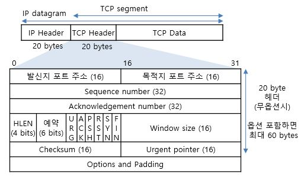

# TGW flow log 

## CloudWatch > Logs Insights
```
parse @message "* * * * * * * * * * * * * * * * * * * * * * * * * * * * * * * * * * * *" as version, resource_type, account_id, tgw_id, tgw_attachment_id, tgw_src_vpc_account_id, tgw_dst_vpc_account_id, tgw_src_vpc_id, tgw_dst_vpc_id, tgw_src_subnet_id, tgw_dst_subnet_id, tgw_src_eni, tgw_dst_eni, tgw_src_az_id, tgw_dst_az_id, tgw_pair_attachment_id, srcaddr, dstaddr, srcport, dstport, protocol, packets, bytes, start, end, log_status, type, packets_lost_no_route, packets_lost_blackhole, packets_lost_mtu_exceeded, packets_lost_ttl_expired, tcp_flags, region, flow_direction, pkt_src_aws_service, pkt_dst_aws_service
| filter (srcaddr like '10.46.244.40')
| display @timestamp, tgw_attachment_id, tgw_src_vpc_account_id, tgw_dst_vpc_account_id, tgw_src_vpc_id, tgw_dst_vpc_id, tgw_src_subnet_id, tgw_dst_subnet_id, tgw_src_eni, tgw_dst_eni, tgw_src_az_id, tgw_dst_az_id, tgw_pair_attachment_id, srcaddr, dstaddr, srcport, dstport, protocol, packets, bytes, start, end, log_status, tcp_flags, flow_direction
| sort @timestamp desc
| limit 30
```
> [전송 제어 프로토콜](https://ko.wikipedia.org/wiki/%EC%A0%84%EC%86%A1_%EC%A0%9C%EC%96%B4_%ED%94%84%EB%A1%9C%ED%86%A0%EC%BD%9C)  
> [TCP 헤더와 특징](https://duddnr0615k.tistory.com/135)  

  

| TCP FLAG | Hex | Digit | 설명 |  
|:---|:---|:---|:---|  
| FIN | 0x01 | 1 | 연결 종료 요청 | 
| SYN | 0x02 | 2 | 연결 요청 플래그 |  
| RST | 0x04 | 4 | 제 연결 종료 |  
| PSH | 0x08 | 8 | 밀어넣기(DATA) |    
| ACK | 0x10 | 16 | 응답 |   
| URG | 0x20 | 32 | 긴급 데이터 |   


