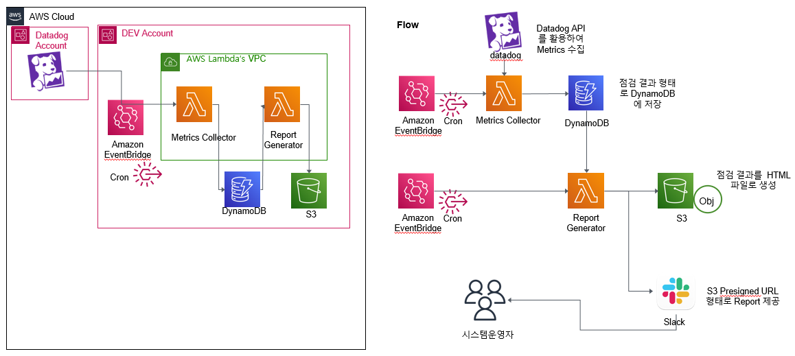
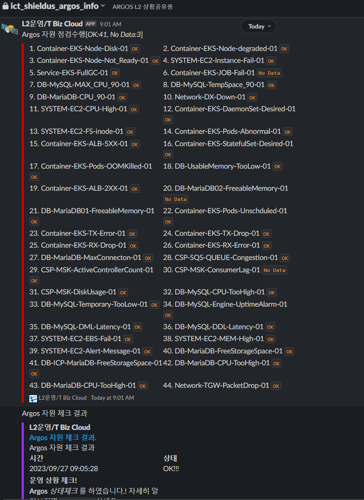

# LCL-14 AWS Resource 운영 Tool 개발 (23/04/24~23/07/23) 

> [LCL-14 개요 - 필독](./LCL-14.md)  
> [MSP](./01.참고자료/MSP.md)  
> [DevOps](./01.참고자료/DevOps.md), [SRE](./01.참고자료/SRE.md)  
> [IaC](./01.참고자료/IaC.md)  
> [Pre-Signed URL](./01.참고자료/Pre-Signed-URL.md)  
> [도서목록](./01.참고자료/도서목록.md)  

---

## 0. 일정 ([수요일 오후 4시 - Google Meet 접속 URL](https://meet.google.com/quq-riuk-bcu?authuser=0))   
> [14. AWS Resource 운영 Tool 개발 (23/04/24~23/07/23)](https://mysuni.sk.com/suni-community/community/COMMUNITY-87/board/BOARD-6zh/1)

| 5월  | 6월 | 7월 | 8월 |   
|:---|:---|:---|:---|  
| [2023-05-03](./02.일정/2023-05-03.md) | [2023-06-07](./02.일정/2023-06-07.md)  | [2023-07-05](./02.일정/2023-07-05.md) | [2023-08-04](./02.일정/2023-08-04.md) |  
| [2023-05-10](./02.일정/2023-05-10.md) | [2023-06-14](./02.일정/2023-06-14.md) | [2023-07-13](./02.일정/2023-07-13.md) | |  
| [2023-05-17](./02.일정/2023-05-17.md) | [2023-06-21](./02.일정/2023-06-21.md) | [2023-07-19](./02.일정/2023-07-19.md) | |  
|[2023-05-31](./02.일정/2023-05-31.md) | [2023-06-28](./02.일정/2023-06-28.md) | [2023-07-26](./02.일정/2023-07-26.md)  | |  

## 1. 산출물
### 1.1 [AWS-Resource-List](./03.LCL활동-산출물/AWS-Resource-List/)
### 1.2 [EC2-TAG](./03.LCL활동-산출물/EC2-TAG/)
### 1.3 [EC2-Autorecovery](./03.LCL활동-산출물/EC2-Autorecovery/)
### 1.4 [DataDog를_활용한_일일점검_및_Notify](./03.LCL활동-산출물/DataDog를_활용한_일일점검_및_Notify/)
- [Dashboard](./03.LCL활동-산출물/DataDog를_활용한_일일점검_및_Notify/Dashboard/)
  - 운영 모니터링에 사용된 Dashboard
  - Datadog Alarm 현황을 볼 수 있음
- [Python](./03.LCL활동-산출물/DataDog를_활용한_일일점검_및_Notify/Python/)
  - Datadog Alert 전체 목록을 가져옴
  - 일일 점검을 위한 `alert_list.py` 를 생성
  - Datadog Alert 전체 목록을 Excel 로 내림
- [Terraform](./03.LCL활동-산출물/DataDog를_활용한_일일점검_및_Notify/Terraform/02.S3/)
  - [00.backend](./03.LCL활동-산출물/DataDog를_활용한_일일점검_및_Notify/Terraform/00.backend/)
    - Terraform 공동 작업을 위한 Backend 생성
    - S3 를 tfstate 저장소로, DyanmoDB 를 Lock Table 로 생성
  - [01.Datadog](./03.LCL활동-산출물/DataDog를_활용한_일일점검_및_Notify/Terraform/01.Datadog/)
    - Datadog Alert 목록을 Terraform Code 로 작성한것
    - 타 프로젝트 이식성을 고려하여 Terraform Code 화 함
  - [02.S3](./03.LCL활동-산출물/DataDog를_활용한_일일점검_및_Notify/Terraform/02.S3/)
    - 시스템 체크 결과를 저장하는 저장소
  - [03.DaynamoDB](./03.LCL활동-산출물/DataDog를_활용한_일일점검_및_Notify/Terraform/03.DynamoDB/)
    - 발생한 Alert 를 저장하는 저장소
    - 일별 보고를 위해 저장
  - [04.Labmda](./03.LCL활동-산출물/DataDog를_활용한_일일점검_및_Notify/Terraform/04.Lambda/)
    - 일일보고을 위한 Alert 저장, 수행, 결과 보고을 위한 코드
    - [00.collection](./03.LCL활동-산출물/DataDog를_활용한_일일점검_및_Notify/Terraform/04.Lambda/00.colletion/)
      - 발생한 Alert 를 DynamoDB 에 저장하는 Labmda(Python Code)
    - [01.daily-check](./03.LCL활동-산출물/DataDog를_활용한_일일점검_및_Notify/Terraform/04.Lambda/01.daily-check/)
      - 매일 09, 20 시에 P1, P2 레벨 Alert 항목으로 체크하여 DynamoDB 에 기록하는 Lambda(Python Code)  
      - 개별 점검 결과는 Slack 채널로 전송함
    - [02.notification](./03.LCL활동-산출물/DataDog를_활용한_일일점검_및_Notify/Terraform/04.Lambda/02.notification/)
      - 매일 09시 5분, 20시 5분에 일일점검 결과를 Slack 에 전송
      - 일일 점검 결과와 그날 발생한 Alert Summary 를 Slack 에서 볼수 있음

  

## 2. 배경
*  MSP 에 대한 이해를 바탕으로 운영에 필요한 자동화 도구를 만들어 보자

## 3. 목표
- 여러가지 것 중 당장 필요한 일일 점검을 통해 실 사용시 건전성을 확인하기 위함 
- 부가적인 운영 자동화 도구 작성
  - 운영보고에 필요한 CostExplorer를 포함한 자원목록
  - 모니터링을 위한 EC2 Tagging 부여 코드 작성
  - 운영 안정성을 위한 EC2 Autorecovery 코드 작성

## 4. 환경
| 항목 |값 | 설명 | 
|:---|:---|:---|  
| COLOR | #003DA6 | LCL 상징 컬러 |  
| 범위 | | 운영시 반복되는 일의 해소 |  
| 화면 | html   Lambda (Python) | 운영자원의 건전성을 보여줌 |    
| DB | DynamoDB | 운영자원의 상태 저장 |
| Storage | S3 | 정적 페이지 저장 |  
| Storage | CloudWatch Event | Lambda 를 주기적으로 실행 |  
| 도구 | aws | AWS CLI(Client) |  
| 도구 | Python  | 자원을 보고 핸들링하는 도구로 Lambda 에서 사용(3.9) |  
| 도구 | Lambda | 자원 점검, Slack Webhook 을 보냄 |  
| 도구 | Slack | Incomming Webhoook   Slack Bot |  
| 도구 | Datadog | 모니터링 용으로 Alert 를 사용하는 용도 |   
| 도구 | Terraform | Datadog Alert 및 AWS 자원 배포 용 |   

## 5. 수행 내역
- MSP 에 대한 이해 
- 현재 당장 필요하고 다른 운영 사이트가 생겼을 때 사용 가능한 도구에 대한 고민
- 일일 점검 도구를 만듬
- 도구로는 AWS 상의 DynamoDB, S3, Lambda(Python), PreSigned URL 과 Datadog 의 Metric 을 활용한 Alert 를 사용햐여 구성(이기정, 방용재)
- Terraform 을 사용한 타 운영 Workload 로의 이식성 고려(서태열)
- 개발 Account 로의 일일점검 환경 및 자원 배포(이진용)

## 6. 결과 
- AWS, Datadog 을 활용한 이식성 있는 일일 점검 도구 확보 - 이기정/방용재/서태열/이진용
- 아키텍처 설계 및 구성 - 이기정
- Datadog Alert 실행, PreSigned URL 구현 - 방용재 
- 일별 Alert 발생을 일별보고 및 상세보기를 위한 기록을 위해 Slack Webhook 및 Lambda  구성 - 서태열
- 개발 계정에 자원 배포 - 이진용
- Terraform 으로 Datadog Alert  입력 - 이기정/방용재/서태열/이진용/이정훈/최종욱

## 7. 배운점 - 다 같이
- MSP 에 대한 이해
- 운영에 필요한 도구 중 일일 점검에 대한 도구 설계 및 구현 이식성 있는 구현에 대한 이해
- AWS 자원 및 Datadog Metric, Monitoring, Dashboard 의 이해 및 장/단점 체감
- Alert 를 기록함으로 시스템 관리 포인트로 활용 가능
- Terraform 을 활용한 자원배포 재활용 및 이식성 확보(-> IaC 에 대한 이해 및 활용)

## 8. TO-DO - 다 같이
- EKS Pod 에 대한 모니터링 보안  
  - 커스텀 메트릭이 필요할 수 있음(?)
  - 슬랙 챗봇을 활용한 Pod 건전성 확인
- Datadog Alert 를 활요한 시스템 점검을 위한 표준 Metric 에 대한 Query 추가 및 보완
  - 현재 Best-Practice 기반 Metric 및 Query 는 60여개 확보된 상황
- 수집된 Alert List 를 활용 방안 개발
  - 현재 Alert List 의 Priority 별 통계 및 발생 당시 상황을 보고 판단 할 수 있는 수준  

## Datadog Alert 작업 담당자 
- 2023.07.21 기준 갯수 이며, 필요시 Alert 추가 가능  
- Tag 에 monitor tag 추가(`datadog-alert-list.py` 를 통해 `alert_list.py` 생성에 사용)
  - `monitor:Container-EKS-Pods-OOMKilled-01`
  - `monitor:DB-UsableMemory-01`

| 분류1 | 분류2 | 갯수 | 담당자 |  
|:---|:---|:---|:---|   
| CSP | ACM   CodeSeries   ElastiCasche   MSK  | 16 | 이기정 |  
| System | EC2   EFS   S3   | 9 | 이진용/이정훈 |  
| Container | EKS | 30 | 서태열 |  
| RDS | MariaDB   MySQL   | 18 | 최종욱, 이진용/이정훈 |  
| Network | DX   TGW   ELB   | 15 | 방용재 |  

